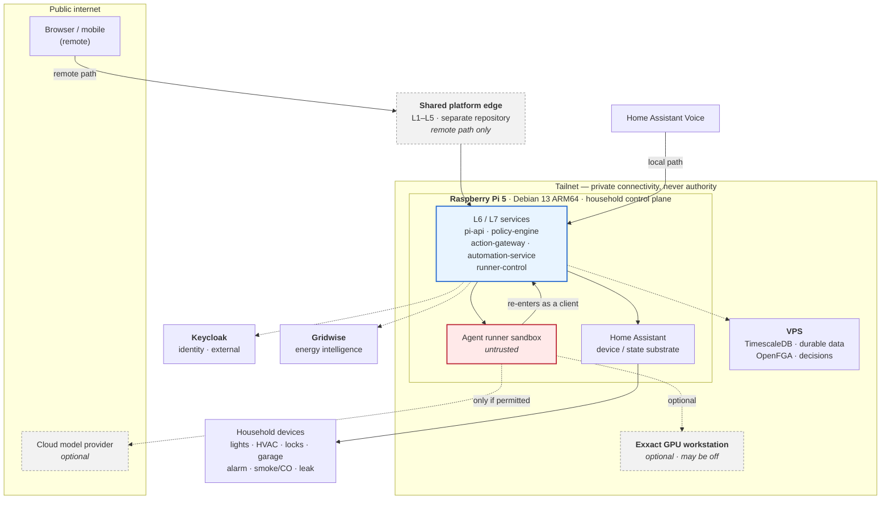
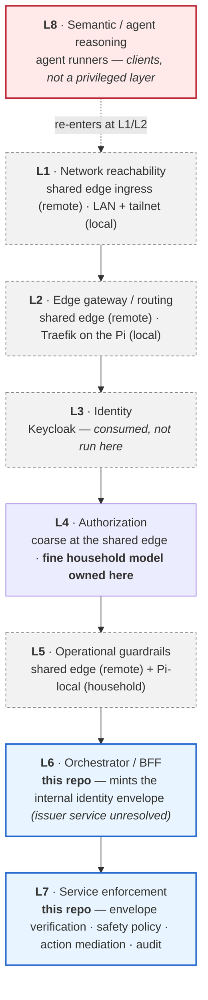
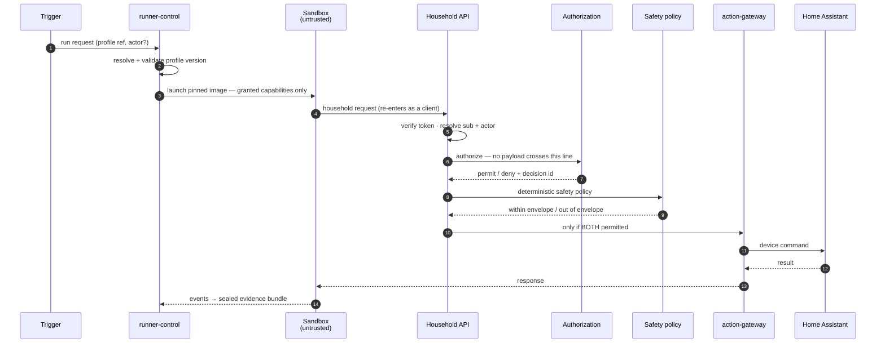
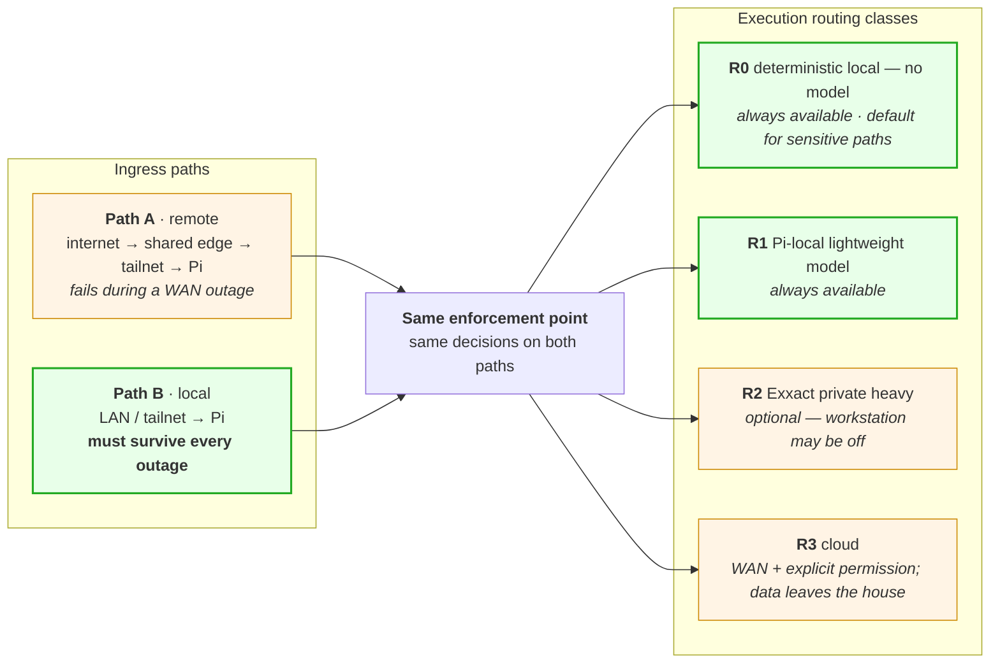
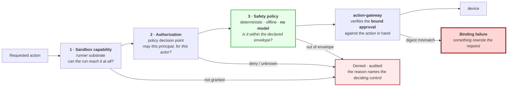

# secure-home-agent-platform

A **local-first, security-first platform for household agents.**

Agents that observe a house and act on it — adjusting climate, watching for
problems, answering questions — running under controls strong enough that they
can be trusted near a door lock, and local enough that the house keeps working
when the internet does not.

> ## Status: contracts, core, orchestration, the knowledge toolchain, the image lineage, and the coding adapters are landed — nothing is deployed
>
> **Landed:** the runner domain contracts; the trusted runner core
> ([`packages/runner-core`](packages/runner-core/)); L4 orchestration
> ([`services/runner-control`](services/runner-control/)) — the typed run
> lifecycle, authority acquisition, the effect boundary, and finalization;
> the knowledge toolchain with repository content admission
> ([`packages/knowledge-toolchain`](packages/knowledge-toolchain/)); the
> L5 image lineage ([`deploy/images/`](deploy/images/)) — the digest-locked
> runner-base, Claude reference, Copilot, and gates-toolchain definitions,
> inert; and the L7 coding adapters
> ([`agents/adapters/coding/`](agents/adapters/coding/)) — Claude Code and
> GitHub Copilot CLI translation to the frozen adapter SPI, conformance-proven
> against stubs, launched by nothing.
>
> **There is still no deployed or activated runtime**: no Home Assistant, no
> running service, no OpenFGA, no Keycloak, no published or activated runner
> image (the image definitions are inert), no launcher or process spawn (the
> adapters exist; nothing can invoke
> them), no L9 physical enforcement, no credentials, no database
> connection, and no durable persistence
> ([U11](docs/architecture/unresolved-decisions.md#u11)). Landed code is not a
> running system.
>
> **ADR-0001 … ADR-0020** are **`Accepted`** and immutable — the foundational set
> on 2026-08-05, the implementation stack on 2026-08-06, the runner
> effect-boundary and identity decisions on 2026-08-17, knowledge-set versioning
> on 2026-08-21, and runner-control placement by workload class on 2026-08-26 —
> so implementation may proceed against them under an authorizing task contract.
> Acceptance is never authorization to deploy.
>
> Of the eleven tracked open questions, three are closed:
> [U6](docs/architecture/unresolved-decisions.md#u6) by ADR-0013,
> [U7](docs/architecture/unresolved-decisions.md#u7) by ADR-0015, and
> [U4](docs/architecture/unresolved-decisions.md#u4) — `runner-control`
> placement — by ADR-0020 on 2026-08-26. The rest remain open. Acceptance is
> **not** authorization to deploy, and `BOUNDED` still behaves as
> `FAIL CLOSED`.
>
> [What acceptance does and does not unblock →](docs/decisions/INDEX.md#what-acceptance-does-and-does-not-unblock) ·
> [What has not been implemented →](#what-has-not-been-implemented)

---

## Why this exists

Home automation platforms and agent frameworks each solve half the problem and
assume the other half away.

Home automation gives you device control with a coarse permission model: a token
that can turn on a lamp can usually also unlock the front door. Agent frameworks
give you capable reasoning with an implicit trust model: the agent runtime holds
the credentials, so a confused or manipulated agent inherits everything the
platform can do.

Put an LLM-driven agent on top of a home automation system with a long-lived
owner token and you have built something that can be talked into opening your
garage.

This project takes the opposite starting point:

1. **Agents are clients, not insiders.** An agent authenticates, is authorized,
   and is subject to policy — exactly like a browser. It gets no privileged
   back-channel and no owner token.
2. **Sensitive actions do not depend on model judgment.** A model may *propose*
   an action. Whether it happens is decided by relationship authorization and a
   deterministic, human-readable safety envelope — with no model in that path.
3. **The house must work when the internet does not.** Household operation does
   not require a WAN round trip, a cloud provider, or a GPU workstation.
4. **The dangerous direction fails closed.** During an outage, closing a garage
   continues; opening one does not. Nobody gains physical access by causing a
   network failure.

The security model is not invented here. It is
[adopted by pinned reference](#security-model) from an existing,
implementation-neutral platform architecture already in use across this
workspace.

## Relationship to Gridwise

**Gridwise already provides energy intelligence** — tariff modelling,
consumption analysis, cost signals. This project does **not** reimplement any of
it and is not an energy product.

Gridwise is an **upstream source**, consumed through its own interface:

- Gridwise **semantics** (what a rate structure means, what a metric represents)
  become knowledge-bundle content — [`knowledge/household/energy-semantics/`](knowledge/household/energy-semantics/).
- Gridwise **signals** may inform a household proposal, such as pre-cooling
  ahead of a peak window.
- A price signal is an **input, never an authority**. Cost does not justify
  leaving the safety envelope.

---

## Topology



| Component | Where | Role |
|---|---|---|
| **Raspberry Pi 5** (8 GB, 256 GB NVMe, Debian 13 ARM64, Docker Compose) | in the house | Household control plane. Owns L6/L7. |
| **Home Assistant Container** | on the Pi *(not yet installed)* | Device and state substrate. Not an authorization boundary. |
| **Shared platform edge** | remote | Shared L1–L5 for the **remote path only**. |
| **Keycloak** | external | Identity for users, services, and agents. Consumed, not run here. |
| **OpenFGA** | topology unresolved | Policy decision point. **Never a request proxy.** |
| **PostgreSQL / TimescaleDB** | VPS | The only authoritative datastore. **Nothing authoritative is on the Pi.** |
| **Exxact GPU workstation** | tailnet | Optional heavy private inference. **May be off.** |
| **Tailscale** | everywhere | Private connectivity. **Never identity, never authorization.** |
| **Gridwise** | existing product | Upstream energy intelligence. |

---

## The eight-layer control model, mapped

This repository inherits an eight-layer control model. Layers are **roles**, not
products — see [ADR-0001](docs/decisions/ADR-0001-adopt-security-first-architecture.md).



| Layer | Owner |
|---|---|
| L1–L5 (remote path) | **shared** — the platform edge, a separate repository |
| L1–L2, L5 (local path) | **this repository** |
| L3 identity | **consumed** — external Keycloak |
| L4 authorization | **shared** coarse + **household fine model owned here** |
| L6, L7 | **this repository** |
| L8 | agent runners — clients, never a privileged layer |

**What the shared edge does not currently provide** — recorded honestly, because
these gaps are this repository's obligations. As reviewed at
`platform-edge` @ `b70894a8`: its authorization model is coarse (`user` and
`api_surface` only — no agent type, no delegation, no household resources), its
L4 runs **audit-only** so a `deny` does not block, principal classification is a
heuristic with agent detection deferred, and it mints no internal identity
envelope.

---

## Agent model

Five concepts, deliberately kept separate
([ADR-0006](docs/decisions/ADR-0006-separate-agent-implementation-profile-run-and-automation.md)):

| Concept | Is | Grants authority? |
|---|---|---|
| **implementation** | domain code — a climate observer | **no** |
| **adapter** | a shim to a runtime — Claude Code, LangGraph, a plain loop | **no** |
| **execution profile** | the reviewed, declarative grant of capability | **yes** |
| **run** | one invocation of one profile; an immutable fact | inherits the profile's |
| **automation** | a persisted, expiring standing arrangement | **yes, separately** |

Merging any two is the failure this model prevents. Most importantly: **shipping
code cannot widen production authority** — only a reviewed profile can.

The **runner substrate** is provider- and framework-neutral. It owns isolation,
mounts, network, secrets, limits, lifecycle, and evidence. One neutral base
image; derived images carry **one pinned coding agent each**
(`…-runner-claude`, `…-runner-copilot`, `…-runner-codex`). A single image
containing every provider is prohibited
([ADR-0011](docs/decisions/ADR-0011-keep-coding-agent-images-provider-specific.md)).

### An agent run, end to end



Step 4 is the load-bearing one: the sandbox **re-enters through the same
enforcement point a browser uses**. There is no internal shortcut.

---

## Local-first availability

Two ingress paths, four execution routing classes. They are independent axes
([ADR-0002](docs/decisions/ADR-0002-adopt-hybrid-home-deployment-profile.md),
[ADR-0007](docs/decisions/ADR-0007-route-local-remote-and-cloud-execution-explicitly.md)).



**No household operation requires Path A, R2, or R3.** Anything essential is
reachable on the local path at R0 or R1.

### What happens during an outage

Classified by **operation and requester**, not by physical direction alone
([`degraded-mode.md`](docs/architecture/degraded-mode.md)):

| Operation | Requester | During an authorization or WAN outage |
|---|---|---|
| Read temperature · lights | anyone | **continue** — no physical risk |
| Close garage · lock door · arm alarm | predeclared automation | **continue** — executing a prior decision |
| Close garage · lock door · arm alarm | human or agent | **bounded** → **fails closed today** |
| Bounded thermostat adjustment | predeclared automation | **continue** within the declared envelope |
| **Open garage · unlock door · disable alarm** | **anyone, including automations** | **fail closed** |
| Smoke/CO · leak shutoff · emergency egress | life-safety trigger | **emergency** — deterministic, local, ungated by design |
| Camera · presence · access history | anyone | **fail closed** — not all reads are safe |
| Grant or change access | anyone | **fail closed** |

A physically-safe direction is *not* the same as a safe requester: closing a
garage can injure someone, locking a door can lock someone out, and unlimited
unauthorized "safe" actions are a denial-of-service channel. Direction sets the
ceiling; **who is asking** sets the floor.

**Nobody gains physical access by causing an outage.** That property is what
makes the rest defensible.

The hardest open question in this repository is how the local path obtains
bounded authority when the central decision point is unreachable — a local
replica, signed capability leases, or a bounded cache. Each trades revocation
latency for availability. **It is deliberately not decided**
([U1](docs/architecture/unresolved-decisions.md#u1)).

---

## Security model

Adopted **by pinned reference**, not copied
([ADR-0001](docs/decisions/ADR-0001-adopt-security-first-architecture.md)):

| Repository | Role | Pinned at |
|---|---|---|
| [`security-first-platform-architecture`](https://github.com/pulse-ops-ai/security-first-platform-architecture) | the contract | tag `v0.3.0` |
| [`platform-edge`](https://github.com/pulse-ops-ai/platform-edge) | reference implementation + shared L1–L5 for the remote path | `main` @ `b70894a8` |

Inherited unmodified: the eight-layer model; trust zones Z0–Z4; **identity and
authorization are distinct layers**; **agents are clients, not insiders**; only
L6 mints the internal identity envelope and L7 verifies it; the policy decision
point decides but is **not a proxy the request travels through**;
**authorization never rests on network position**.

### Three separate controls, in order



Each is owned by a different component. Each can deny. **None can be skipped —
including for an administrator.**

The controls are **chained, not merely sequenced**: the approval that reaches the
gateway is cryptographically bound to the exact action type, resource, and
parameter digest, and the gateway recomputes that digest before dispatching
anything physical. A bare decision reference would be a bearer credential for
whatever action its holder attached it to.

Safety policy runs **after** authorization so it can constrain an authorized
principal, and so it does not leak resource bounds to an unauthorized one.
It uses **numbers, times, and physical state** — never relationships, and never
a model
([ADR-0005](docs/decisions/ADR-0005-separate-capability-authorization-and-safety.md),
[ADR-0008](docs/decisions/ADR-0008-use-openfga-for-relationships-and-deterministic-policy-for-safety.md)).

**Never, anywhere:** a Home Assistant long-lived owner token in an agent runner;
a direct database connection from a sandbox; a Docker network or the tailnet
treated as authority; an unbound decision reference treated as proof that *this*
action was approved.

Physical actions are **observable, not atomic.** A garage door genuinely can end
up half-open, so the gateway models a lifecycle — `dispatched → acknowledged →
observed-in-progress → observed-succeeded | observed-failed | timed-out |
indeterminate` — with idempotency keys and reconciliation, rather than promising
a transaction boundary that physical devices cannot honour.

---

## Repository layout

```
├── AGENTS.md              universal agent contract — read this first
├── CLAUDE.md              Claude Code adapter
├── .github/               Copilot instructions, scoped agent definitions, PR template
├── .claude/               OpenSpec skills and slash commands for Claude Code (generated)
├── openspec/              OpenSpec spec-driven change workflow — config · specs · changes
├── docs/
│   ├── architecture/      system context · trust boundaries · runner model ·
│   │                      identity flow · routing · degraded mode · open questions
│   ├── decisions/         ADR-0001 … ADR-0020  (all Accepted, immutable)
│   └── operations/        runbooks — Pi bootstrap
├── services/              deployable backend processes — TypeScript
│   ├── control-plane/     household API · authorization · safety policy ·
│   │                      action mediation · automations (Nest modules, ONE process)
│   ├── runner-control/    the runner substrate — separate process
│   └── workers/           specialist workers, off the request path
│       └── python-inference/  the ONLY admitted Python boundary (uv)
├── apps/                  human-facing applications only
│   └── web/               household web application
├── packages/              reusable libraries, no runtime identity
│   ├── contracts/         authored Zod contract source
│   ├── api-contracts/     operation contracts · operation catalog
│   ├── query-model/       projection config · validated query AST
│   ├── worker-base/       standard worker runtime contract
│   ├── logging/ observability/ errors/ events/
│   ├── testing/           shared Vitest configuration
│   └── eslint-config/ tsconfig/    shared tooling
├── agents/                household agents (NOT coding agents)
│   ├── implementations/   domain code — grants no authority
│   └── adapters/          coding/{claude-code,copilot-cli,codex}
│                          frameworks/{custom-loop,pydantic-ai,langgraph}
├── profiles/              execution profiles — WHERE AUTHORITY IS GRANTED
├── schemas/               generated contracts: profile · run · action · automation
├── knowledge/             OKF-oriented knowledge bundles — experimental
├── deploy/                images · compose · traefik · tailscale (no runtime)
├── tests/                 profile · framework · policy-scenario conformance
└── scripts/               validate-scaffold.sh · check.sh
```

**Taxonomy** — role, not language ([ADR-0012 §5](docs/decisions/ADR-0012-adopt-typescript-nestjs-pnpm-implementation-stack.md)):
`services/` deployable backend processes · `apps/` human-facing applications ·
`packages/` reusable libraries with no runtime identity · `agents/` agent
implementations and profiles.

Two workspaces: **`pnpm`** for TypeScript — the primary stack, covering
`services/*`, `services/workers/*`, `apps/*`, `packages/*` — and **`uv`**
retained **only** for `services/workers/python-inference`, the single admitted
Python boundary.

> **Some package boundaries carry real implementations now** — the contracts,
> `runner-core`, `runner-control`, and `knowledge-toolchain`. Others remain
> deliberately empty so the workspace, dependency direction, and CI target
> selection stay real and testable. An empty boundary is a placeholder, not a
> claim that nothing is built.

## How to navigate this repository

| You are… | Start at |
|---|---|
| a **human**, new here | this file, then [`docs/architecture/INDEX.md`](docs/architecture/INDEX.md) |
| a **coding agent** (any vendor) | [`AGENTS.md`](AGENTS.md) — mandatory |
| **Claude Code** | [`AGENTS.md`](AGENTS.md), then [`CLAUDE.md`](CLAUDE.md) |
| **Copilot** | [`AGENTS.md`](AGENTS.md), then [`.github/copilot-instructions.md`](.github/copilot-instructions.md) |
| reviewing a **decision** | [`docs/decisions/INDEX.md`](docs/decisions/INDEX.md) — has a "which ADRs apply?" table |
| about to **change a directory** | that directory's `README.md` — it says what does *not* belong there too |
| looking for **what is undecided** | [`docs/architecture/unresolved-decisions.md`](docs/architecture/unresolved-decisions.md) |
| **setting up the Pi** | [`docs/operations/pi-bootstrap.md`](docs/operations/pi-bootstrap.md) |

**Instruction precedence** — higher wins:
accepted ADRs and governed contracts → the applicable `AGENTS.md` →
provider-specific instruction files → the task prompt. A prompt cannot authorize
crossing an architectural contract.

## Verify a working copy

```sh
bash scripts/check.sh          # everything; reports skipped checks explicitly

# structure and governance — no toolchain required
bash scripts/validate-scaffold.sh
bash scripts/scan-secrets.sh

# TypeScript — the primary stack
pnpm install --frozen-lockfile
pnpm run deps:check            # Syncpack manifest policy
pnpm run format:check          # Prettier — the single formatting authority
pnpm run check:workspace       # taxonomy + dependency direction
pnpm lint && pnpm typecheck && pnpm test && pnpm build

# Python — the admitted inference boundary only
uv sync --all-packages --locked
uv run ruff check . && uv run ruff format --check . && uv run mypy && uv run pytest
```

Toolchain setup for a fresh Pi: [`docs/operations/pi-bootstrap.md`](docs/operations/pi-bootstrap.md).

The portable subset is the repository **merge gate**
([`.github/workflows/checks.yml`](.github/workflows/checks.yml)), running on
every pull request with `uv sync --locked` and `pnpm install --frozen-lockfile`
so a stale lockfile fails rather than being silently rewritten. Its third-party
actions are pinned to **full commit SHAs** — CI is part of the governance
boundary — and `scripts/scan-secrets.sh` scans **every tracked text file** for
secret-shaped values, including the workflow and the scanner itself, with no
file-level exclusion and no in-line suppression pragma. Pattern matching cannot
inspect binary content, so `validate-scaffold.sh` **forbids tracked binaries**
outright rather than leaving that as an unstated assumption.

---

## Decisions accepted

All **`Accepted`** and now **immutable** — the foundational eleven on
2026-08-05, the implementation stack on 2026-08-06. Reverse or amend only by a
superseding ADR. Acceptance records and the unblocked/still-blocked breakdown:
[`docs/decisions/INDEX.md`](docs/decisions/INDEX.md).

| | |
|---|---|
| [ADR-0001](docs/decisions/ADR-0001-adopt-security-first-architecture.md) | Adopt the security-first architecture by pinned reference |
| [ADR-0002](docs/decisions/ADR-0002-adopt-hybrid-home-deployment-profile.md) | Adopt a hybrid-home deployment profile |
| [ADR-0003](docs/decisions/ADR-0003-use-framework-neutral-runner-profiles.md) | Framework-neutral runner contracts and execution profiles |
| [ADR-0004](docs/decisions/ADR-0004-treat-agents-as-clients.md) | Agents are clients, not insiders |
| [ADR-0005](docs/decisions/ADR-0005-separate-capability-authorization-and-safety.md) | Separate sandbox capability, authorization, and safety policy |
| [ADR-0006](docs/decisions/ADR-0006-separate-agent-implementation-profile-run-and-automation.md) | Separate implementation, profile, run, and automation |
| [ADR-0007](docs/decisions/ADR-0007-route-local-remote-and-cloud-execution-explicitly.md) | Route local, remote, and cloud execution explicitly |
| [ADR-0008](docs/decisions/ADR-0008-use-openfga-for-relationships-and-deterministic-policy-for-safety.md) | OpenFGA for relationships, deterministic policy for safety |
| [ADR-0009](docs/decisions/ADR-0009-define-degraded-mode-and-offline-authorization.md) | Degraded mode and offline authorization posture |
| [ADR-0010](docs/decisions/ADR-0010-use-okf-for-portable-knowledge-only.md) | OKF for portable knowledge only |
| [ADR-0011](docs/decisions/ADR-0011-keep-coding-agent-images-provider-specific.md) | Provider-neutral base, provider-specific coding-agent images |
| [ADR-0012](docs/decisions/ADR-0012-adopt-typescript-nestjs-pnpm-implementation-stack.md) | TypeScript, NestJS, and pnpm as the implementation stack |

## What has not been implemented

**Nothing is deployed or activated.** Code has landed; no process runs anywhere.
Specifically absent, on purpose:

| Area | State |
|---|---|
| Home Assistant | **not installed.** No instance, no credential, no configuration. |
| Services | `runner-control` carries the landed L4 orchestration behind ports, with **no endpoint served and no process started**; the remaining members are manifests and placeholders. |
| Authorization | **No household model.** The shared coarse model is explicitly not adopted. |
| Safety policy | **No declaration format, no evaluator.** |
| Runner substrate | Orchestration semantics are implemented, and the L5 image definitions are landed and inert ([`deploy/images/`](deploy/images/), digest-locked, referenced by no profile); **no published or activated image, no sandbox, no launcher, and no L9 physical enforcement.** |
| Execution profiles | **Schema landed** ([`schemas/execution-profile/`](schemas/execution-profile/), generated from the Zod contract); **no profile instance exists**, and the image-lineage checker refuses one that references an image. |
| Schemas | The L2 contract corpus is **generated and identity-ledger-guarded** under [`schemas/`](schemas/) — execution profile, run, run events, evidence, launch assertion, path policy, gate registry, verification packs. |
| Knowledge bundles | **`platform/**` modules are authored** and `Validated` at `1.0.0` against their own human-reviewed bytes — see `knowledge/catalog.json` for which, and for exact status. Three coding set releases are human-reviewed and recorded in `knowledge/set-releases.json`; `household/**` families remain unreleased. Nothing is packaged and nothing is published — publication is unavailable while no governed Proof B producer exists, and a released set is not runtime-resolvable. |
| Web application | Deliberately not scaffolded — depends on an open decision. |
| Deployment | **The L5 image Dockerfiles and lineage lock are landed** — built and verified only through the governed CI path, published nowhere; **no Compose file, no proxy or tailnet configuration, no execution runtime selected.** |
| Credentials | **None, anywhere.** |
| Runtime dependencies | Only what the landed packages need. No service dependency is installed for a runtime that does not run. |

### Deliberately undecided

Eleven open questions are tracked in
[`unresolved-decisions.md`](docs/architecture/unresolved-decisions.md). Each is
closed by a **new** ADR, never by an implementation.
[U6](docs/architecture/unresolved-decisions.md#u6) was closed by ADR-0013
(2026-08-12), [U7](docs/architecture/unresolved-decisions.md#u7) by ADR-0015
(2026-08-15), and [U4](docs/architecture/unresolved-decisions.md#u4) by
ADR-0020 (2026-08-26) — each by *answering* the question, which is the only
mechanism that file admits. U4's answer decided **where** the runner substrate
runs and stood nothing up. Every other item is open, and
[U11](docs/architecture/unresolved-decisions.md#u11) (persistence toolkit) was
*added* by ADR-0012 rather than answered by it.

The most consequential is
[U1](docs/architecture/unresolved-decisions.md#u1): how the local path obtains
bounded authority offline. Until it is answered, everything that would need it
**fails closed**.

## Contributing

[`CONTRIBUTING.md`](CONTRIBUTING.md) for humans, [`AGENTS.md`](AGENTS.md) for
agents, [`SECURITY.md`](SECURITY.md) for vulnerability reporting.

Implementation issues and epics are created by the human planning workflow
**after** these ADRs are reviewed.
