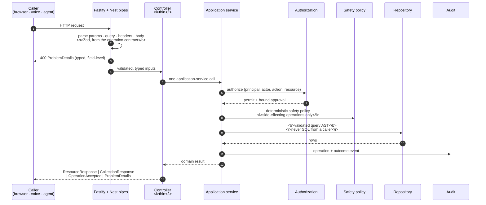
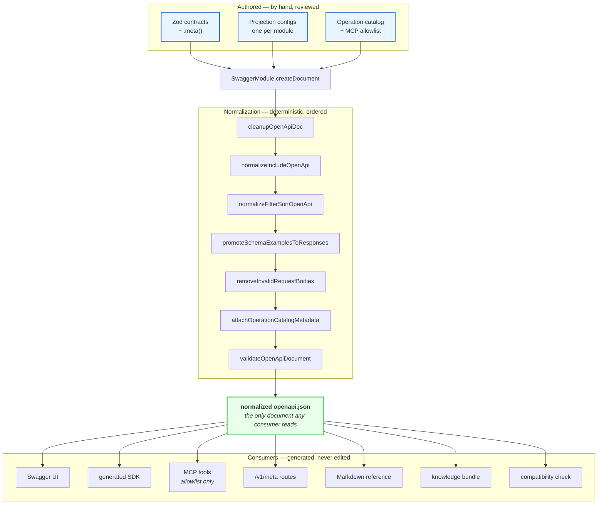

# API Contract Model

How a governed API operation is defined once and consumed everywhere: by a
NestJS controller, OpenAPI, a Next.js client, a generated SDK, the metadata
routes, and an MCP tool.

Governed by
[ADR-0012](../decisions/ADR-0012-adopt-typescript-nestjs-pnpm-implementation-stack.md).
That ADR decides; this document is what follows from it.

> **Status: not implemented, and ADR-0012 is `Proposed`.** No package, decorator,
> pipeline, or route described here exists. Do not build against this document
> until the ADR is accepted **and** a task contract authorizes the specific work.

## The rule everything else follows from

> **One Zod definition per contract. Everything else is generated.**

If a second artifact describes the same contract — a validation class, a Swagger
decorator, a hand-written interface, a parallel JSON schema — that artifact is
the defect, not the missing piece.

Zod is authoritative for API and domain-facing contracts. **It is not
authoritative for database tables**; persistence is modelled separately, and a
table never becomes a DTO automatically.

## Request flow



The controller does **not** authorize, evaluate policy, build queries, or shape
envelopes. It routes, parses, and delegates. Everything security-relevant is in
the application service, where it is testable without HTTP.

## Generation pipeline



**No consumer reads the raw Nest output.** CI fails on a duplicate or missing
`operationId`, a request body on GET/HEAD, an example that fails its own schema,
non-deterministic output, drift, or an unapproved breaking change.

### Publishable Zod features

Only JSON-Schema-representable constructs may cross the published boundary.
Zod's converter throws by default on `bigint`, `int64`, `symbol`, `undefined`,
`void`, `date`, `map`, `set`, `nan`, `custom`, `function`, and `transform`.

**Keep the default** (`unrepresentable: "throw"`). The alternative emits `{}` — a
schema that validates anything, published as if it constrained something.

Use `z.iso.datetime()` rather than `z.date()` at the boundary; timestamps are
UTC ISO-8601 strings on the wire. Where a transform makes input and output
differ, generate request and response schemas separately.

## 1 · Zod contract with `.meta()`

`.meta()` is not decoration. It is where the semantics an agent needs live — and
the same text becomes the OpenAPI description, the SDK docstring, the metadata
route, and the MCP tool description.

```ts
import { z } from 'zod'

export const GarageDoorState = z
  .object({
    id: z.string().uuid().meta({
      description: 'Stable platform identifier for the door.',
      examples: ['3f1c9d2e-0000-4000-8000-000000000000'],
    }),

    areaId: z.string().meta({ description: 'Area this door belongs to.' }),

    position: z.enum(['closed', 'open', 'opening', 'closing', 'unknown']).meta({
      description:
        'Observed physical position. `unknown` is a real answer, not an ' +
        'error: it means the platform could not establish the position.',
      'x-agent-guidance':
        'Never report "closed" unless position is exactly "closed". ' +
        'If "unknown", say so and say why — do not infer from lastChangedAt.',
    }),

    observedAt: z.iso.datetime().meta({
      description: 'UTC timestamp of the observation this state came from.',
    }),

    freshness: z.enum(['fresh', 'stale', 'unavailable']).meta({
      description:
        'Whether the observation is current. `stale` means the value is real ' +
        'but older than the resource freshness budget.',
    }),
  })
  .meta({
    id: 'GarageDoorState',
    title: 'Garage door state',
    description: 'Deterministic, read-only state of one garage door.',
    'x-sensitivity': 'household-sensitive',
  })

export type GarageDoorState = z.infer<typeof GarageDoorState>
```

Rules:

- **`id` in `.meta()` is required** on any schema published as a reusable OpenAPI
  component; it is what makes the `$ref` stable across regenerations.
- **Every field carries a description.** A field an agent cannot interpret is a
  field it will misuse.
- **Sensitivity is declared, not inferred.**
- Custom `x-` keys pass through `toJSONSchema` unchanged, which is how agent
  guidance reaches the published document.

## 2 · Zod path parameters

```ts
export const GarageDoorParams = z.object({
  doorId: z.string().uuid().meta({
    description: 'Identifier of the garage door.',
    examples: ['3f1c9d2e-0000-4000-8000-000000000000'],
  }),
})
```

**Hard rules.**

- Every key must appear in the route template, and every template placeholder
  must appear in the schema. A mismatch fails contract validation at startup —
  not at the first request.
- **An optional path parameter is a contract error.** OpenAPI path parameters are
  always required; `z.string().optional()` here must fail the build rather than
  produce a document that lies.

## 3 · Operation contract

One object joining everything the platform needs to know about an operation. It
is the row the operation catalog stores and the source
`attachOperationCatalogMetadata` reads.

```ts
export const GetGarageDoorState = defineOperation({
  operationId: 'garage.getDoorState',      // stable; duplicates fail CI
  method: 'GET',
  path: '/v1/garage/doors/{doorId}/state',

  summary: 'Read the current state of one garage door.',
  params: GarageDoorParams,
  response: ResourceResponse(GarageDoorState),

  capability: 'household.garage.read',      // ADR-0008 relationship check
  sensitivity: 'household-sensitive',
  sideEffect: 'read-only',                  // read-only | proposed-action | actuation
  confirmation: 'none',                     // none | user-confirm | actor-required
  idempotency: 'inherent',                  // inherent | key-required | not-idempotent

  audit: { onSuccess: 'garage.state.read', onDenied: 'garage.state.denied' },

  degradedMode: {
    class: 'CONTINUE',                      // docs/architecture/degraded-mode.md
    note: 'Local, non-sensitive read. May return freshness "stale" or ' +
          '"unavailable" rather than failing.',
  },

  mcp: {
    eligible: true,                          // allowlist — not automatic
    useWhen: 'The user asks whether a specific garage door is open or closed.',
    doNotUseWhen:
      'The user asks to open or close a door — this operation cannot actuate. ' +
      'Do not use to infer whole-home security posture.',
  },
})
```

`sideEffect`, `confirmation`, `sensitivity`, and `degradedMode` are **security
metadata**, not documentation. They drive confirmation prompts, MCP eligibility
review, and degraded-mode behaviour.

## 4 · Thin NestJS controller

```ts
@Controller()
export class GarageController {
  constructor(private readonly garage: GarageService) {}

  @ApiContract(GetGarageDoorState)
  @Get('/v1/garage/doors/:doorId/state')
  async getDoorState(
    @ZodParams(GarageDoorParams) params: z.infer<typeof GarageDoorParams>,
  ) {
    return this.garage.getDoorState(params.doorId)
  }
}
```

That is the whole handler, and it is the maximum. **No** `class-validator`, **no**
`class-transformer`, **no** `@ApiProperty`, **no** hand-written Swagger DTO class.

`ApiContract` is the composite that expands to the granular decorators; use those
directly only where an operation genuinely needs to diverge:

| Decorator | Provides |
|---|---|
| `ApiZodParams(schema)` | OpenAPI path parameters + route-template cross-check |
| `ApiZodQuery(schema)` | OpenAPI query parameters, normalized filter/sort/include shape |
| `ApiZodBody(schema)` | OpenAPI request body — **rejected on GET and HEAD** |
| `ApiZodResponse(schema, status)` | response schema + examples promoted from `.meta()` |
| `ApiContract(operation)` | all of the above from one operation contract, plus catalog registration |

Matching runtime pipes — `ZodParams`, `ZodQuery`, `ZodHeaders`, `ZodBody` — parse
and type the inputs. **The decorator and the pipe read the same schema**, so the
documented contract and the enforced contract cannot diverge.

Validation failure produces `ProblemDetailsResponse` with field-level errors,
never a framework stack trace.

## 5 · Module projection configuration

Exactly one per API module. **This is the module's maximum query surface** —
authorization may narrow it for a caller, nothing may widen it.

```ts
export const AutomationProjectionConfig = defineProjectionConfig({
  resource: 'automation',

  fields: {
    id:     { selectable: true, always: true },
    name:   { selectable: true, filter: { operators: ['eq', 'contains'] }, sortable: true },
    status: { selectable: true, filter: { operators: ['eq', 'in'] }, sortable: true },
    expiresAt: {
      selectable: true,
      filter: { operators: ['lt', 'lte', 'gt', 'gte', 'between'] },
      sortable: true,
    },
    ownerId: { selectable: true, sensitivity: 'household-sensitive' },
  },

  includes: {
    owner:  { maxDepth: 1, cost: 1 },
    events: { maxDepth: 1, cost: 5, maxItems: 20 },
  },

  defaultFields: ['id', 'name', 'status', 'expiresAt'],
  defaultSort: [
    { field: 'createdAt', direction: 'desc' },
    { field: 'id', direction: 'asc' },        // stable tie-breaker — required
  ],

  maxPageSize: 100,
  maxIncludeCost: 10,
})
```

It drives, without a second declaration: the Zod query DTO · runtime query
validation · OpenAPI filter/sort/include/fields metadata ·
`/v1/meta/resources/automation` · MCP and agent query guidance · generated SDK
helpers · UI filter and sort controls · repository query-AST validation.

**Non-negotiable properties.**

- An undeclared field, filter, operator, sort, or include is **rejected** — never
  silently dropped and never passed through.
- `defaultSort` **must** end in a unique tie-breaker, or cursor pagination is not
  stable and pages can repeat or skip rows.
- Include depth, item count, and cost are bounded, so one request cannot become
  an unbounded traversal.
- **Models and MCP clients emit only a validated query AST.** No SQL, no ORM
  predicates, no arbitrary field expressions ever reach a repository.

## 6 · Response envelopes

Four families, and nothing else:

| Envelope | For |
|---|---|
| `ResourceResponse<T>` | one resource |
| `CollectionResponse<T>` | a list |
| `OperationAcceptedResponse` | accepted long-running or asynchronous work |
| `ProblemDetailsResponse` | every error — RFC 9457 |

```ts
{
  data: [
    { id: '…', name: 'Evening lockdown', status: 'enabled', expiresAt: '2026-12-01T00:00:00Z' },
  ],

  page: {
    hasNextPage: true,
    hasPreviousPage: false,
    startCursor: 'b3BhcXVl…',
    endCursor: 'b3BhcXVl…',
    pageSize: 25,
    count: { mode: 'none' },        // 'exact' | 'estimated' | 'none'
  },

  query: {
    filters: [{ field: 'status', operator: 'eq', value: 'enabled' }],
    sort: [
      { field: 'createdAt', direction: 'desc' },
      { field: 'id', direction: 'asc' },
    ],
    defaultSortApplied: true,
    fields: ['id', 'name', 'status', 'expiresAt'],
    includes: [],
  },

  meta: {
    operationId: 'automation.listAutomations',
    requestId: '01JD…',
    correlationId: '01JD…',
    generatedAt: '2026-08-06T12:00:00Z',
    schemaVersion: '1.0.0',
    queryModelVersion: '1.0.0',
    warnings: [
      { code: 'freshness.stale', message: 'One or more rows are older than the freshness budget.' },
    ],
  },
}
```

Rules:

- **Cursor pagination by default.** Cursors are **opaque** and bound to the
  normalized filters, sort, projection, and include context — a cursor from one
  query must not be usable against another.
- **No exact count by default.** Counting is requested explicitly and always
  labelled `exact`, `estimated`, or `none`. An unbounded count on the VPS is a
  foreseeable way to make a household read look like an outage.
- **`query` echoes what was actually applied**, including whether the default
  sort was used, so a caller never guesses.
- **Warnings are typed and machine-readable.** A partial or stale result is
  distinguishable from a complete one — required by
  [ADR-0009](../decisions/ADR-0009-define-degraded-mode-and-offline-authorization.md)'s
  prohibition on silent degradation.

## Metadata routes

| Route | Returns |
|---|---|
| `GET /v1/meta` | resources, operations, versions, capabilities overview |
| `GET /v1/meta/resources/:resource` | fields, types, enums, nullability, examples, labels and aliases, sensitivity, filterable/sortable/projectable/includable sets, allowed operators per field, default sort and tie-breaker, cursor contract and max page size, relationships, freshness and degraded semantics, supported operations, schema and query-model versions |
| `GET /v1/meta/operations/:operationId` | purpose, `useWhen` / `doNotUseWhen`, request and response schemas, examples, query capabilities, side-effect class, confirmation posture, idempotency, capability required, audit event names, degraded-mode behaviour |

All three are **generated** from the Zod contracts, the operation catalog, and
the projection configs — never a hand-maintained parallel catalog.

**Security.** Metadata is authorization-filtered where disclosure is itself
sensitive, and never exposes credentials, Home Assistant entity IDs, database
columns or SQL structure, OpenFGA tuples, hidden fields, or implementation-only
routes. **Metadata describes; it never grants.** Discovering an operation is not
permission to invoke it.

**Relationship to OpenAPI.** OpenAPI remains the full protocol contract.
`/v1/meta` is the task-oriented runtime view for clients and natural-language
agents. They are generated from the same source, so they cannot disagree.

## Cross-cutting conventions

| Concern | Convention |
|---|---|
| **Logging** | Winston behind a shared logging package. Structured, never `console`. No secrets, tokens, or household PII in log lines. |
| **Request context** | `AsyncLocalStorage` carries request id, correlation id, causation id, principal `sub`, and `actor` — never threaded through signatures by hand. |
| **Event names** | Stable, machine-readable, dotted: `garage.state.read`. Renaming one is a breaking change to consumers and dashboards. |
| **Correlation / causation** | Correlation id spans a whole interaction; causation id names the event that caused this one. Both are required on agent-initiated requests. |
| **Audit** | A **separate durable contract**, not logging ([ADR-0004](../decisions/ADR-0004-treat-agents-as-clients.md)). Audit loss blocks a sensitive action; a dropped log line does not. |
| **Errors** | RFC 9457 problem details with a stable `type` URI, machine-readable `code`, and field-level detail. Never a raw framework error. |
| **Concurrency** | Optimistic, via ETag or a version field. A conditional update that loses is `412`, never a silent overwrite. |
| **Idempotency** | Mutations declare `inherent`, `key-required`, or `not-idempotent`. `key-required` operations accept an idempotency key and must not act twice ([`../../services/action-gateway/README.md`](../../services/action-gateway/README.md)). |
| **Long-running work** | `OperationAcceptedResponse` with an operation id and a poll or subscribe path. Never a synchronous request that blocks on a physical device. |
| **Timestamps** | UTC, ISO-8601, `z.iso.datetime()`. No local times, no naive timestamps, no epoch integers on the wire. |
| **Versioning** | `schemaVersion` and `queryModelVersion` in every envelope, so a client can detect a contract it does not understand. |

## What is deliberately not specified here

- The persistence toolkit — [U11](unresolved-decisions.md#u11).
- The adapter SPI for agent runtimes — [U6](unresolved-decisions.md#u6). Nothing
  here applies to it; runner contracts stay provider-neutral
  ([ADR-0003](../decisions/ADR-0003-use-framework-neutral-runner-profiles.md)).
- Whether the decorator layer is first-party or built over an existing adapter.
  The contract is fixed; the implementation is a bounded choice.
- Any concrete household resource. `garage` and `automation` above are
  illustrative sketches, not committed contracts.
