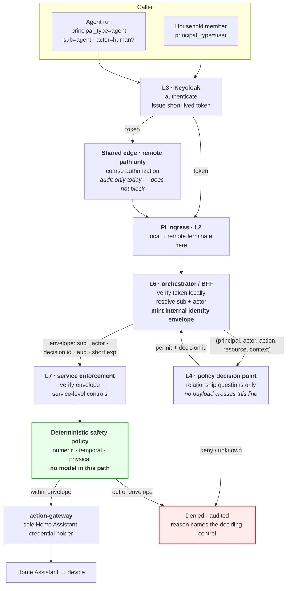

# Identity and Authorization Flow

How a request earns the right to change something in the house.

Governed by [ADR-0004](../decisions/ADR-0004-treat-agents-as-clients.md),
[ADR-0005](../decisions/ADR-0005-separate-capability-authorization-and-safety.md),
and [ADR-0008](../decisions/ADR-0008-use-openfga-for-relationships-and-deterministic-policy-for-safety.md).

> **Status: not implemented.** No identity integration, no authorization model,
> no envelope issuer, and no policy engine exists in this repository.

## Identity is not authorization

Inherited from upstream and restated because it is the distinction everything
else rests on:

- **Identity (L3)** answers *who is calling*. Keycloak. Slow-changing. Issues
  short-lived, verifiable tokens.
- **Authorization (L4)** answers *may they*. A policy decision point. Fast-changing.
  Never encoded in identity-token claims.

Permissions in a token would mean every permission change is an identity change
and every revocation waits for token expiry. In a house, that means a removed
guest keeps access until their token expires.

## Principals

| Principal type | Is | Authenticates with | Notes |
|---|---|---|---|
| `user` | a household member, guest, or operator | interactive Keycloak flow | |
| `service` | a platform component | service credential | |
| `agent` | one agent run | short-lived workload identity | **Never** a shared static key. **Never** a human's credential. |

**Do not assume the shared edge distinguishes these.** Reviewed at
`platform-edge` @ `b70894a8`: principal type is a heuristic on
`preferred_username` (`service-account-*` ⇒ `service`, otherwise `user`), agent
detection is explicitly deferred, and **every** OpenFGA subject is written
`user:<realm>__` regardless of type. Agent delegation is not available
upstream today. This repository must model it itself.

## `sub` and `actor`

When an agent acts for a person, **both** principals are carried:

| Claim | Is |
|---|---|
| `sub` | the **agent** principal — the run's own identity |
| `actor` | the **human** principal the run is acting for |

Rules:

1. Both are evaluated. The agent must be permitted to act for that actor **and**
   the actor must be permitted the action on the resource. Both must pass.
2. **An agent never gains authority its actor lacks.** An actor never gains
   authority by routing through an agent.
3. An **autonomous** run has **no** `actor`, and that absence is explicit — a
   distinct declared value, never an empty or missing field. An autonomous run
   must never be mistakable for a human-authorized one.
4. Both are recorded in audit for every agent-initiated request.

## The full flow

## Layer by layer

### L3 — identity (consumed)

Keycloak, operated externally. Issues short-lived tokens for users, services, and
agents. Tokens are verifiable offline against published keys — which matters,
because token verification must keep working when Keycloak is unreachable.

**Token TTL is a security/availability trade.** Short TTL means fast revocation
and a shorter offline-operation window; long TTL means the opposite. The value is
an explicit decision, not a default.

### Shared edge — coarse authorization (remote path only)

The shared edge asks a coarse question: may this principal reach this surface at
all? Two facts must be carried forward:

1. **It is audit-only today.** A `deny` there does not stop the request.
2. **It is not a substitute for the fine decision.** The household question is
   about devices and areas, not routes.

The local path does not traverse the shared edge at all.

### Pi ingress and L6 — the enforcement point

Both paths converge here, and here the control plane does its own work:

- **verifies the token itself.** It does not accept an upstream assertion as
  proof. Upstream `x-platform-edge-*` headers may be consumed **only** after
  origin provenance is validated — upstream states this explicitly, and it is
  inherited as a requirement.
- **resolves `sub` and `actor`.**
- **asks the policy decision point** the fine-grained relationship question.
- **mints the internal identity envelope** — L6 is the only issuer.

**Which service is the envelope issuer is unresolved.** See
[`unresolved-decisions.md`](unresolved-decisions.md).

### L4 — the policy decision point

Answers relationship questions: who lives here, which device is in which area,
which agent may act for which human, which capability class applies.

**Hard rule: the request does not travel through it.** The enforcement point
holds the request, asks `(principal, action, resource, context)`, and receives a
decision. No request body, no household payload, no device command ever crosses
this boundary. This mirrors the sidecar pattern already proven upstream.

An `unknown` decision is **not** a permit.

### Internal identity envelope

Minted by L6, verified by every L7 service. Carries at least: `sub`,
`principal_type`, `actor` (or an explicit autonomous marker), the authorization
decision reference, issuer, audience, issued-at, a **short** expiry, a unique
envelope id, and a correlation id.

- **Only L6 mints it.** No other component.
- **It never crosses the edge boundary.** External callers always re-authenticate.
- **Every L7 service verifies it** — signature, audience, expiry, replay. A
  service that skips verification is a defect, not an optimization.
- Verification is **not** optional because the services share a Docker network.
  See [`trust-boundaries.md`](trust-boundaries.md).

### L7 — service enforcement

Verifies the envelope, applies service-level controls, scopes data access, and
emits audit.

### Deterministic safety policy — after authorization

Runs **after** authorization succeeds, so it can constrain an authorized
principal. Deterministic, offline-evaluable, legible to a household member, and
**with no model in the path**. A principal who "may control the thermostat" is
still refused a setpoint outside the declared envelope.

Ordering matters in the other direction too: putting safety policy *before*
authorization would leak resource existence and bounds to principals with no
authority over them.

See [ADR-0005](../decisions/ADR-0005-separate-capability-authorization-and-safety.md).

### Action mediation

The **only** component holding Home Assistant credentials, and the only path
from the platform to a device. Executes an action only when authorization
permitted it and safety policy approved it.

## Audit

Every request that reaches an enforcement point produces a record with: the
correlation id, `sub`, `actor` (or explicit autonomous), `principal_type`, the
authorization decision and its id, the safety-policy verdict, the action, the
resource, the outcome, and — for agent-initiated requests — the run and profile
version.

**Every denial is audited too**, and names the deciding control (authorization,
safety policy, or sandbox capability). "Denied" with no reason is a defect.

The correlation property this requires — one identifier joining edge, enforcement
point, and service records — is already demonstrated upstream, so it is known to
be achievable.

## Open

- Which service issues the envelope.
- Whether the household authorization store shares a runtime with the shared
  edge store.
- The workload-identity mechanism for agent runs.
- Policy-decision caching semantics per sensitivity class.
- Token TTL, and how token verification behaves during an identity-provider
  outage.

All tracked in [`unresolved-decisions.md`](unresolved-decisions.md).
