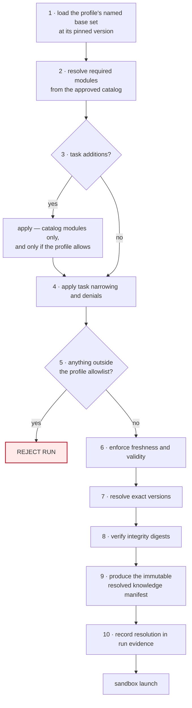

# Knowledge Selection Model

How an execution profile selects knowledge, how a runner resolves that selection,
and what the run records about it. Governed by
[ADR-0010](../decisions/ADR-0010-use-okf-for-portable-knowledge-only.md),
[ADR-0003](../decisions/ADR-0003-use-framework-neutral-runner-profiles.md),
[ADR-0006](../decisions/ADR-0006-separate-agent-implementation-profile-run-and-automation.md),
and [ADR-0011](../decisions/ADR-0011-keep-coding-agent-images-provider-specific.md).

> **Status: the toolchain exists; runtime selection does not.** The format is
> decided
> ([ADR-0015](../decisions/ADR-0015-adopt-okf-v0-2-as-source-representation-only.md),
> which resolved [U7](unresolved-decisions.md#u7)), and compile / validate /
> package / query are **implemented** in
> [`packages/knowledge-toolchain`](../../packages/knowledge-toolchain/) and
> invoked over real repository content in CI.
>
> What this document describes is still absent: **no runtime resolver**, **no
> profile knowledge field or schema**, **no deployed knowledge delivery**, **no
> released set**, **no published module**, and **no Proof B producer**. This is
> the contract those things must satisfy.

## The rule everything else follows from

**Knowledge is context, not authority.**

Selecting a module tells a run what it may *understand*. It never tells a run
what it may *do*. Knowledge selection is independent of, and composes with, all
of these:

| Independent of | Owned by |
|---|---|
| tool permission | the execution profile's tool surface |
| filesystem and network permission | the runner substrate, from profile declarations |
| governed API capability | the API surface and its operation catalog |
| authorization | the policy decision point ([ADR-0008](../decisions/ADR-0008-use-openfga-for-relationships-and-deterministic-policy-for-safety.md)) |
| deterministic safety policy | the safety envelope ([ADR-0005](../decisions/ADR-0005-separate-capability-authorization-and-safety.md)) |
| live state | the governed API |

A run holding `household/climate` can describe what a heat pump is rated to. It
still cannot read a thermostat, and it still cannot change one. If knowledge and
live state disagree, **live state wins** and the run reports the discrepancy.

This is why knowledge remains available during an outage without weakening any
control: having context is not having permission.

## Three concepts

```text
knowledge module   one independently versioned body of portable knowledge
knowledge set      a named, profile-oriented composition of allowed modules
packaged bundle    the immutable, digest-addressed artifact delivered to a run
```

A profile names a **set**. The resolver turns that set into exact module
versions and one **packaged bundle**. A profile never names a repository file
path, and a run never reads a bundle file directly — access is through the
`query` interface required by ADR-0010, so the format stays replaceable.

## 1. The profile selection contract

A provider-neutral field group. **The field names below are the contract; the
serialization is not.** Whether a profile is authored in YAML or JSON belongs to
the profile schema, which does not exist yet
([`profiles/schema/`](../../profiles/schema/)); this document does not decide it.
The example is YAML only because the issue that requested this contract used
YAML, and it is illustrative rather than binding.

```yaml
knowledge:
  set: implement-local-default@1        # named base set, version-pinned
  required:                             # must resolve, or the run is rejected
    - platform/core-operating-model@1
    - platform/governance@1
  optional:                             # may be absent; absence is recorded
    - platform/api-contract-conventions@1
  deny:                                 # patterns, never file paths
    - household/*
  taskAdditions: allowed                # may a task contract add modules?
  taskNarrowing: allowed                # may a task contract remove them?
  maxBytes: 1048576                     # packaged size ceiling
  maxContextTokens: null                # reserved; no tokenizer is committed to
  maxFreshnessDays: 180                 # staleness ceiling for required modules
  requiredFailure: reject-run           # the only permitted value
  optionalFailure: warn                 # warn | omit
  overrideAuthority: profile-change-review
```

| Field | Contract |
|---|---|
| `set` | the named base composition, pinned to a version. A moving reference is not permitted, for the reason automations bind pinned profile versions ([ADR-0006](../decisions/ADR-0006-separate-agent-implementation-profile-run-and-automation.md)). |

> **No set version is assignable yet, and the reason is now concrete.** Every
> registered set carries a `version` field — the registry is version-capable,
> because this contract and the evidence fields below both require it — but every
> one is `null`, because **every set still has required members that carry no
> version**, and **no set has been released**. Whether a set becomes
> version-assignable is derived from its actual members rather than from any
> count: as platform modules are authored some required members are now
> versioned and some are not, and a set can only pin what resolves. Every set is
> additionally rollout-blocked, and set release and composition lifecycle are
> not settled here. A set version that pins
> nothing resolvable would make two different resolutions look identical in
> evidence, so [`check-knowledge.mjs`](../../scripts/check-knowledge.mjs) rejects
> a set that carries a version while selecting an unversioned module. The
> `@1` in the example above is therefore illustrative of the *shape*, not
> something a profile could write today.
| `required` | modules whose absence, invalidity, or staleness **rejects the run**. |
| `optional` | modules whose absence produces a typed warning and is recorded. |
| `deny` | module IDs or single-level `group/*` patterns. Denial beats every other rule, including a task addition. |
| `taskAdditions` | whether a task contract may add modules **from the approved catalog**. Never arbitrary content. |
| `taskNarrowing` | whether a task contract may drop modules the profile selected. |
| `maxBytes` | ceiling on the packaged artifact. Exceeding it rejects the run rather than silently truncating. |
| `maxContextTokens` | reserved and unset. A token budget requires committing to a tokenizer, which would put a provider detail in a structural field. |
| `maxFreshnessDays` | how stale a required module's as-of date may be before it is treated as invalid. |
| `requiredFailure` | `reject-run`. It is a field so the contract is explicit, not so it can be weakened. |
| `optionalFailure` | `warn` or `omit`. |
| `overrideAuthority` | who may change any of the above. A profile change is a security change and is reviewed as one. |

### Neutrality

No structural field may name a provider or framework — not Copilot, Codex,
Claude, NestJS, Zod, or OKF. This is the ADR-0003 neutrality rule applied to the
knowledge seam: **if adding a provider requires changing these field names, the
contract was not neutral.** Provider names may appear only as opaque values of an
`adapter` field, and in prose or examples.

Note that **"OKF" is excluded too, and the reason has changed.** The format is
no longer undecided —
[ADR-0015](../decisions/ADR-0015-adopt-okf-v0-2-as-source-representation-only.md)
pinned OKF v0.2 as the source representation. The exclusion stands anyway,
because the selection seam is **format-neutral by design**, not by default: a
profile selects a named set and the runner resolves it to module versions and
digests, none of which depends on how the source is written. An `okf` field
would bind the selection contract to a source format it has no business knowing
about, and would have to be renegotiated the day the format moved.

Three separable facts, and this document owns only the middle one:

| | |
|---|---|
| **format decision** | ADR-0015 — pinned OKF v0.2 source representation |
| **selection contract** | this document — provider-neutral **and** format-neutral, structurally |
| **implementation** | compile / validate / package / query — **implemented**; the runtime resolver that would consume them is not |

## 2. Resolution semantics

The runner resolves the selection **before sandbox launch**, so that a run either
starts with a known, recorded knowledge state or does not start.



Properties the algorithm must have, whatever implements it:

1. **Deny wins.** A denied module cannot be reinstated by a task addition, by a
   set composition, or by any ordering of the steps.
2. **Additions are catalog-only.** A task contract selects from the approved
   catalog; it never supplies content and never names a path.
3. **Narrowing is always permitted to fail closed.** Removing a module can only
   reduce what a run understands, so it is the safe direction — but a set may
   still forbid narrowing away a module it considers load-bearing, by marking it
   required and disallowing narrowing.
4. **Evidence precedes execution.** Step 10 happens before step 11. A run that
   crashes during launch still has a record of what it was about to be given.
5. **Resolution is reproducible.** The same profile version, task contract, and
   catalog digest resolve to the same manifest and the same compiled digest.

**This document does not implement the algorithm.** It states what the
implementation must satisfy.

## 3. Failure semantics

| Condition | Outcome |
|---|---|
| required module missing | **reject run** |
| required module invalid | **reject run** |
| required module stale beyond the set's freshness policy | **reject run** |
| digest mismatch | **reject run** |
| module outside the profile allowlist | **reject run** |
| packaged size above `maxBytes` | **reject run** |
| optional module unavailable | typed warning, recorded |
| optional module stale | typed warning **or** omission, per `optionalFailure` |

**Required knowledge is never silently downgraded to optional.** A resolver that
responded to a missing required module by continuing with less context would
produce a run that looks successful and reasoned from a different world than the
one reviewed. That is the failure this table exists to prevent, and it is why
`requiredFailure` has exactly one permitted value.

A rejected run is a **normal outcome**. It is recorded with its cause, the same
way an authorization denial is.

## 4. Run evidence

A run records exactly what knowledge it saw, so the question "what did this run
know?" is answerable without re-running it.

```json
{
  "knowledge": {
    "requestedSetId": "implement-local-default",
    "requestedSetVersion": "1.0.0",
    "resolvedSetId": "implement-local-default",
    "resolvedSetVersion": "1.0.0",
    "resolverVersion": "0.0.0",
    "catalogDigest": "sha256:...",
    "modules": [
      {
        "id": "platform/core-operating-model",
        "version": "1.0.0",
        "digest": "sha256:...",
        "asOf": "2026-08-08",
        "disposition": "required"
      }
    ],
    "omittedOptional": [
      { "id": "platform/api-contract-conventions", "reason": "unavailable" }
    ],
    "warnings": [],
    "compiledDigest": "sha256:..."
  }
}
```

| Field | Why it is recorded |
|---|---|
| `requestedSetId` / `requestedSetVersion` | what the profile asked for |
| `resolvedSetId` / `resolvedSetVersion` | what it actually got — these differ when a task narrowed the selection |
| `resolverVersion` | a resolver change can change the outcome; without this, an old run is not explicable |
| `catalogDigest` | pins the catalog the resolution was computed against |
| `modules[]` | exact ID, version, digest, as-of date, and whether it was required or optional |
| `omittedOptional[]` | absence is a fact about the run, not a non-event |
| `warnings[]` | typed, so they can be counted and alerted on rather than read |
| `compiledDigest` | identifies the packaged artifact actually delivered |

Recording both requested and resolved is what makes a narrowed run reviewable: a
run that quietly received less than its profile selected would otherwise be
indistinguishable from one that received everything.

**Persistence is not implemented here.** This defines the fields; where run
evidence is stored is [U11](unresolved-decisions.md#u11) and the run schema.

## 5. Adoption note for the existing runner substrate

**Read this before building anything against it.**

Prior runner and profile work exists outside this platform effort. This document
does **not** redesign the execution-profile contract and does not assume the
profile schema starts from scratch. It defines only the **knowledge-policy seam**
that a future runner-baseline review will map onto what already exists.

Concretely, the seam requires four things of whatever the runner substrate turns
out to be:

1. a profile field group carrying the contract in §1, under whatever field
   names the adopted schema settles on — the *semantics* are the contract, and
   the names above are the neutral default;
2. resolution completed **before** sandbox launch, per §2;
3. the failure dispositions in §3, with `reject-run` genuinely rejecting;
4. the evidence fields in §4 present in the run record.

**Not decided here, and deliberately left to that review:** where the resolver
runs, how the catalog is distributed to it, how a packaged bundle is stored and
addressed, and the profile serialization.

The next runner-focused task is **not** "build the runner from scratch." It is to
inventory the existing runner substrate and classify each capability as **adopt
unchanged**, **adapt to new platform contracts**, **replace deliberately**, or
**defer** — and then to update the runner-control and profile/image issues
around what actually exists rather than replacing working code.

## What this document does not do

- It does not author or publish knowledge content.
- It does not choose the knowledge format.
  [ADR-0015](../decisions/ADR-0015-adopt-okf-v0-2-as-source-representation-only.md)
  already did, pinning OKF v0.2. This document defines the selection seam
  **independently of the source format**, which is why no `okf` field appears in
  it.
- It does not implement compile, validate, package, or query.
- It does not define concrete profiles, runner images, or sandbox enforcement.
- It does not resolve any item in [`unresolved-decisions.md`](unresolved-decisions.md).

## Governed by

[`../../AGENTS.md`](../../AGENTS.md) · [`../AGENTS.md`](../AGENTS.md) ·
[`INDEX.md`](INDEX.md)
