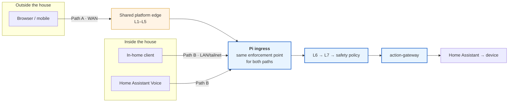
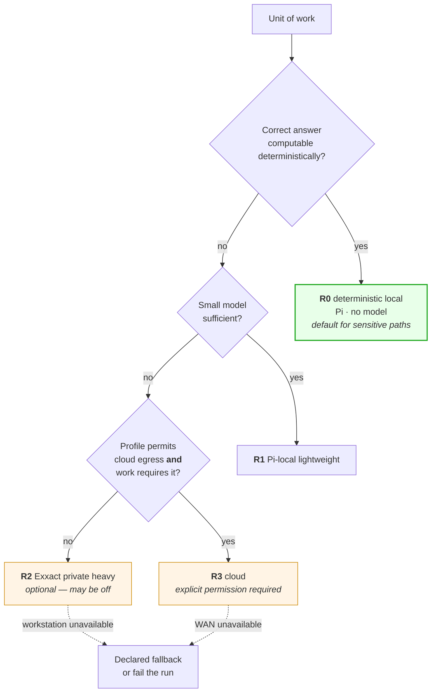

# Local, Remote, and Cloud Routing

Two **ingress** paths and four **execution** routing classes. They are different
axes and are frequently confused; this document keeps them apart.

Governed by
[ADR-0002](../decisions/ADR-0002-adopt-hybrid-home-deployment-profile.md) (paths)
and
[ADR-0007](../decisions/ADR-0007-route-local-remote-and-cloud-execution-explicitly.md)
(classes).

> **Status: not implemented.**

## Axis 1 — ingress paths

### Path B: local household path

```
in-home client or Home Assistant Voice
  → LAN / tailnet
  → Pi ingress (L2)
  → L6 (verify token · authorize · mint envelope)
  → L7 (verify envelope · safety policy)
  → action-gateway → Home Assistant → device
```

- **No WAN round trip. No shared edge. No cloud.**
- This is the path that must survive an outage.
- It is **fully governed** — local does not mean unauthenticated. The only thing
  that changes is which components are in the path.

### Path A: remote/public path

```
browser or mobile (outside the house)
  → public internet
  → shared platform edge (L1–L5)
  → tailnet
  → Pi ingress (L2)
  → L6 → L7 → action-gateway → Home Assistant → device
```

- Adds the shared edge's L1–L5 controls in front of the same Pi enforcement.
- **Depends on the WAN and the shared edge.** Expected to fail during an outage,
  and to fail visibly.
- The shared edge's coarse decision is **audit-only today** and does not block.

### The equivalence requirement

**Both paths terminate at the same enforcement point and receive the same
decisions.** Path A adds controls in front; it does not replace anything.

This is the profile's principal risk: a control added to one path and forgotten
on the other is a bypass. It must be tested
([`tests/policy-scenarios/`](../../tests/policy-scenarios/)), not assumed.

Corollaries:

- The local path never skips authorization because it is local.
- The remote path never relies solely on the edge's decision.
- Neither path may treat network position as authority.



## Axis 2 — execution routing classes

*Where computation happens* — declared in the execution profile, enforced by the
runner substrate, recorded on the run.

| Class | Where | Use for | Available when | Data leaves the house? |
|---|---|---|---|---|
| **R0** deterministic local | Pi, **no model** | safety interlocks, thresholds, schedules, state transitions | always (Pi up) | no |
| **R1** Pi-local lightweight | Pi, small model | intent classification, short summarization, phrasing | always (Pi up), memory permitting | no |
| **R2** Exxact private heavy | GPU workstation over the tailnet | deep analysis, long context, batch, evaluation | **only when the workstation is on** | no — stays in the tailnet |
| **R3** cloud | third-party provider | work exceeding local capability; coding-agent runs | WAN up **and** the profile permits it | **yes** |

### Rules

1. **Declared, never inferred.** The class is a profile field. No runtime
   auto-selection.
2. **No implicit escalation.** R0 never silently becomes R1; R2 never silently
   becomes R3. Any fallback is declared, only ever *downward* in capability, and
   recorded on the run.
3. **Sensitive decisions are R0.** A model may propose a sensitive action; the
   decision is authorization plus deterministic safety policy, both R0.
4. **Enforced by the substrate.** An R0 profile is launched with no model egress
   at all. The class is not advisory.
5. **Recorded on the run**, so "did household data leave the house?" is
   answerable from audit.



## How the axes interact

They are independent. A request on either ingress path may trigger work in any
routing class the profile permits.

| Ingress | Execution | Example |
|---|---|---|
| Path B (local) | R0 | Voice command: turn off the kitchen light |
| Path B (local) | R1 | Voice command with ambiguous intent, classified locally |
| Path B (local) | R2 | Local request for a week-long comfort analysis — **fails or degrades if the workstation is off** |
| Path A (remote) | R0 | Remote request to close the garage — deterministic decision, remote ingress |
| Path A (remote) | R3 | Coding-agent run triggered from outside the house |

The important non-combination: **there is no household operation that requires
Path A or requires R2/R3.** Anything essential is reachable on Path B at R0 or
R1.

## Failure behaviour by path and class

| What is unavailable | Path A | Path B | R0 | R1 | R2 | R3 |
|---|---|---|---|---|---|---|
| WAN | ✗ lost | ✓ works | ✓ | ✓ | ✓ | ✗ |
| Shared edge | ✗ lost | ✓ works | ✓ | ✓ | ✓ | ✓ |
| Exxact workstation | ✓ | ✓ | ✓ | ✓ | ✗ declared fallback | ✓ |
| VPS | degraded — no durable writes | degraded — no durable writes | ✓ | ✓ | ✓ | ✓ |
| Authorization decision point | see [`degraded-mode.md`](degraded-mode.md) | see [`degraded-mode.md`](degraded-mode.md) | — | — | — | — |
| Pi | ✗ | ✗ | ✗ | ✗ | — | — |

The Pi is the single point of failure for household operation. That is inherent
to a local-first posture and is accepted; it is not hidden.

## Data egress

| Class | Household data reaches |
|---|---|
| R0 | nothing outside the Pi |
| R1 | nothing outside the Pi |
| R2 | the workstation, within the tailnet |
| R3 | **a third party** — only the categories the profile declares |

A profile routing to R3 must declare which data categories may be sent. Anything
not declared must not be sent. The declared-category vocabulary does not exist
yet ([ADR-0007](../decisions/ADR-0007-route-local-remote-and-cloud-execution-explicitly.md),
follow-up obligation 5).

Knowledge bundles are safe to send to any class **by construction**, because
[ADR-0010](../decisions/ADR-0010-use-okf-for-portable-knowledge-only.md) forbids
secrets, live state, and presence in them. That is one of the main reasons the
prohibited-content rule is enforced rather than advisory.
