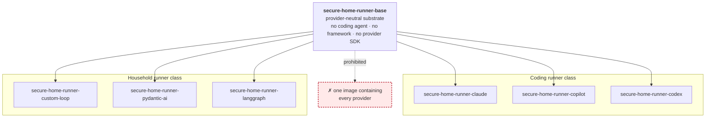
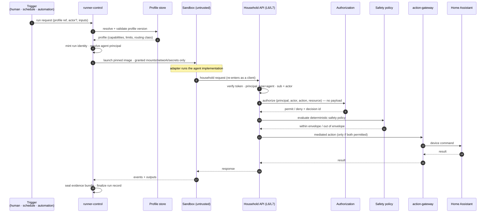

# Runner Model

How agents execute. Governed by
[ADR-0003](../decisions/ADR-0003-use-framework-neutral-runner-profiles.md),
[ADR-0006](../decisions/ADR-0006-separate-agent-implementation-profile-run-and-automation.md),
[ADR-0011](../decisions/ADR-0011-keep-coding-agent-images-provider-specific.md),
[ADR-0013](../decisions/ADR-0013-define-the-runner-adapter-spi.md),
[ADR-0017](../decisions/ADR-0017-classify-asynchronous-effects-at-runner-boundaries.md),
and [ADR-0018](../decisions/ADR-0018-separate-attempt-durable-fact-and-finalization-identity.md).

The distributed semantics of a run — how orchestration crosses an asynchronous
boundary, and what identities a durable effect carries — are described in
[`effect-boundary-model.md`](effect-boundary-model.md) and
[`distributed-effect-lifecycle.md`](distributed-effect-lifecycle.md). This page
is the whole execution model; those two zoom in.

> **Status: contracts, core, and orchestration are landed; nothing executes
> yet.**
>
> | | |
> |---|---|
> | **Landed** | **L2** runner domain contracts — execution profiles, runs and events, verification, evidence — authored as Zod in [`packages/contracts`](../../packages/contracts/) and [`packages/events`](../../packages/events/), generated under [`schemas/`](../../schemas/) and guarded by an append-only identity ledger. **L3** the trusted runner core, [`packages/runner-core`](../../packages/runner-core/). **L4** orchestration, [`services/runner-control`](../../services/runner-control/) — the typed run lifecycle, authority acquisition, gate scheduling, finalization, and the port boundary |
> | **Not yet real** | provider execution adapters, where not yet landed; a real launcher or container execution substrate; a deployed `runner-control` process; **L9** physical enforcement of isolation; durable persistence, still open under [U11](unresolved-decisions.md#u11) |
>
> Orchestration semantics are implemented **behind ports**, against
> deterministic reference mechanisms. What is absent is the substrate that would
> make them physically true of a real process.
> The program is ratified by the `runner-baseline-adoption` constitution
> (PR #48; canonical spec:
> [`../../openspec/specs/runner-adoption/spec.md`](../../openspec/specs/runner-adoption/spec.md))
> — sixteen normative adoption invariants and landings L2–L10, each
> implemented only through its own externally authorized child change.
> Canonical capability specs from L2:
> [`execution-profile`](../../openspec/specs/execution-profile/spec.md) ·
> [`runner-execution`](../../openspec/specs/runner-execution/spec.md) ·
> [`runner-verification`](../../openspec/specs/runner-verification/spec.md) ·
> [`runner-evidence`](../../openspec/specs/runner-evidence/spec.md)

## The five concepts, and why they are not the same thing

| Concept | Is | Carries authority? | Lives in |
|---|---|---|---|
| **Agent implementation** | domain code — a climate observer, a security reviewer | **No** | [`agents/implementations/`](../../agents/implementations/) |
| **Runtime adapter** | the shim to a concrete runtime — a coding-agent CLI or a framework | **No** | [`agents/adapters/`](../../agents/adapters/) |
| **Execution profile** | the reviewed, declarative grant of capability | **Yes — this is where authority is granted** | [`profiles/`](../../profiles/) |
| **Run** | one invocation of one profile; an immutable historical fact | inherits the profile's | [`schemas/run-record/`](../../schemas/run-record/) |
| **Automation** | a persisted standing arrangement that causes runs | **Yes — separately authorized** | [`services/control-plane/`](../../services/control-plane/) |

Merging any two of these is the failure this model exists to prevent. Most
importantly: **merging implementation and profile** would mean shipping code
could widen production authority without a security review.

## Image lineage

**One runtime per derived image, pinned.** A multi-provider image is prohibited —
[ADR-0011](../decisions/ADR-0011-keep-coding-agent-images-provider-specific.md).

## The base image

Contains substrate concerns only:

- profile loading and validation,
- the run lifecycle: start, cancel, timeout, teardown,
- the event emitter and evidence capture hooks,
- the minimal OS surface required for the above.

Contains **nothing** provider- or framework-specific: no coding agent, no
framework, no provider SDK, no provider credential handling. It does not know
which adapter it will launch.

## The runner substrate

Owned by [`services/runner-control/`](../../services/runner-control/). For every
run, regardless of what runs inside:

| Concern | Contract |
|---|---|
| **Isolation** | One run, one container, one process tree. No shared writable state between runs. |
| **Filesystem** | Only profile-declared mounts, each with an explicit read/write posture. No implicit host access. |
| **Network** | **Default deny.** Egress only to profile-declared destinations, consistent with the declared routing class ([ADR-0007](../decisions/ADR-0007-route-local-remote-and-cloud-execution-explicitly.md)). |
| **Secrets** | Only credentials the profile declares, scoped to the run, never ambient. **No Home Assistant token. No database connection.** |
| **Limits** | CPU, memory, wall clock, and output size. The Pi also carries the household control path; a run must not starve it. |
| **Lifecycle** | Start, cancel, timeout, teardown. Cancellation must be effective, not advisory. Teardown must be complete. |
| **Events** | A uniform event stream, identical in shape across adapters. |
| **Evidence** | A per-run bundle: profile version, image digest, principals, granted capabilities, calls attempted, calls permitted, calls denied, outcome. |

**Two different layers, and only one of them is landed.** The table above states
what the substrate must enforce; that enforcement is **L9** and does not exist.
What exists is **L4 orchestration**: the run's lifecycle, its bounded port
boundary, and its finalization semantics, described in
[`effect-boundary-model.md`](effect-boundary-model.md) and
[`distributed-effect-lifecycle.md`](distributed-effect-lifecycle.md). L4 decides
and records; L9 makes isolation, limits, and teardown physically true. Neither
substitutes for the other, and an implemented L4 must not be read as an enforced
L9.

The substrate is provider- and framework-neutral. It does not import an adapter;
it launches one as an isolated process.

## The adapter

Translates a run request into what a concrete runtime expects, and translates
that runtime's output back into the platform event and evidence contract.

- **Coding adapters:** Claude Code, GitHub Copilot CLI, Codex.
- **Framework adapters:** custom deterministic loop, PydanticAI, LangGraph.

Rules:

1. An adapter **cannot widen its own sandbox.** It receives what the profile
   granted, and nothing else.
2. An adapter **must not** reach around the substrate for network, filesystem, or
   credentials.
3. Every adapter emits the **same** event and evidence contract for the same
   logical run. This is asserted by
   [`tests/framework-conformance/`](../../tests/framework-conformance/).
4. If a runtime needs something the profile does not grant, the resolution is a
   reviewed profile change — never an adapter workaround.

## The execution profile

The reviewable artifact that binds everything and grants authority:

| Field group | Contents |
|---|---|
| Identity | profile name, version |
| Runtime | runner image (digest-pinned), adapter |
| Capability | permitted tool surface, filesystem mounts and posture, network policy (default deny), credential grants as named references |
| Execution | routing class (R0–R3), model route, declared fallback behaviour |
| Limits | wall clock, CPU, memory, pids, output size |
| Principal | the agent identity the run authenticates as; whether an `actor` is required |
| Knowledge | the named knowledge set the run may reason from — [`knowledge-selection-model.md`](knowledge-selection-model.md) |
| Evidence | the evidence contract the run must satisfy |

The knowledge field group is **not** a capability. It says what a run may
*understand*, never what it may *do*; a selected module grants no tool, no
mount, no egress, and no authorization. Its contract is specified separately and
is **not yet schema**.

**A run is launched from a profile, never from ad-hoc parameters.** Anything the
profile does not grant is denied. Schema:
[`schemas/execution-profile/`](../../schemas/execution-profile/), generated from
the authored Zod contract in [`packages/contracts`](../../packages/contracts/)
(canonical requirements:
[`execution-profile`](../../openspec/specs/execution-profile/spec.md)).

## Runner classes

| | **Coding runner** | **Household runner** |
|---|---|---|
| Purpose | operates on repositories and documents | observes and acts on the house |
| Tool surface | source control, filesystem, build and test | household read APIs, action requests |
| Network | source control and a model provider, per profile | household API; model access per routing class |
| Household device access | **none, ever** | only via the action-mediation service, after authorization and safety policy |
| Typical routing class | R3 (cloud) | R0/R1, occasionally R2 |
| Runs on | the Pi or a workstation | the Pi |
| Profiles | [`profiles/coding/`](../../profiles/coding/) | [`profiles/household/`](../../profiles/household/) |

A coding runner has **no path to household devices**. This is enforced by the
profile's tool surface and network policy, not by convention.

## Run request path

Step 6 is the load-bearing one: the sandbox **re-enters through the same
governed enforcement point** a browser would use. There is no internal path.

## Evidence and events

Every run produces:

- **an event stream** — start, capability grant, each attempted call and its
  disposition, adapter lifecycle transitions, termination reason;
- **an evidence bundle** — profile version, image digest, principals (`sub`,
  and `actor` or an explicit "autonomous, no actor"), granted capabilities,
  calls attempted/permitted/denied, outputs, outcome, timing.

Properties: **uniform across adapters**, **sufficient to answer "what was this
allowed to do, and what did it do?"** without reading agent code, and durable —
subject to the buffering constraint that the Pi is not authoritative storage.

The shapes are landed L2 contracts —
[`runner-execution`](../../openspec/specs/runner-execution/spec.md) (run
records, the closed terminal vocabulary, the closed event vocabulary) and
[`runner-evidence`](../../openspec/specs/runner-evidence/spec.md) (the evidence
bundle) — generated under [`schemas/`](../../schemas/).

**What emits them is landed; what makes them durable is not.** L4 orchestration
produces the journal, the terminal event, and the evidence bundle through its
port boundary, against **deterministic in-memory reference implementations**.
Real durable persistence is [U11](unresolved-decisions.md#u11), still open, and
it inherits the finalization contract rather than choosing it —
[`distributed-effect-lifecycle.md`](distributed-effect-lifecycle.md).

**How they become visible is a decided architecture, not a write order.**
Finalization stages every fallible participant invisibly and publishes them in
exactly one visibility transition; "seal the bundle last" is not the model. See
[`distributed-effect-lifecycle.md`](distributed-effect-lifecycle.md).

## Cancellation, timeout, resources

- Every run has a **wall-clock timeout**. There is no unbounded run. L4 enforces
  this today as **one absolute governed expiry** that may be narrowed and never
  restarted, checked at every port boundary —
  [`effect-boundary-model.md`](effect-boundary-model.md).
- Cancellation is **effective**, and that requirement has two halves at two
  layers. **L4, landed:** an interrupted continuation unwinds and starts no
  later orchestration effect, so no delayed result can resume a run that has
  ended. **L9, absent:** terminating the real process tree and tearing down the
  sandbox. Nothing in this repository kills a process today; when the launcher
  exists, L9 must prove real termination and isolation. Orchestration bounding
  itself is not the same as a workload being stopped.
- **Terminal settlement is bounded separately.** When ordinary execution stops,
  recording the intended terminal gets a short, fresh bound. Exhausting it is
  **settlement failure**, never a manufactured lifecycle `TIMED_OUT` —
  [`effect-boundary-model.md`](effect-boundary-model.md).
- Resource limits protect the household control path on the shared Pi.
- **A killed run cannot leave a device in an unrecorded state.** The runner
  cannot actuate directly; every physical effect goes through the mediation
  service, which owns the action lifecycle. A run killed mid-action does not
  abandon the action — the gateway continues to observe it to a terminal state
  (including `indeterminate`) and records it.
  **This is not a promise that devices behave atomically.** A garage door
  genuinely can end up half-open; that outcome is *represented*, not prevented.
  See [`../../services/control-plane/README.md`](../../services/control-plane/README.md).
- Runs are **not** on the household safety path. A dead substrate must not
  affect local safety automations.

## Open

- Whether `runner-control` runs on the Pi, on the VPS, or both
  ([U4](unresolved-decisions.md#u4)).
- The workload-identity mechanism for run credentials
  ([U2](unresolved-decisions.md#u2)).
- Durable persistence for the run's facts ([U11](unresolved-decisions.md#u11)),
  which inherits the finalization contract rather than choosing it.

**No longer open.** The adapter SPI — what the substrate passes in, what an
adapter returns, how failure is reported — was decided by
[ADR-0013](../decisions/ADR-0013-define-the-runner-adapter-spi.md) on
2026-08-12, closing [U6](unresolved-decisions.md#u6). Asynchronous effect
semantics at the port boundary were decided by
[ADR-0017](../decisions/ADR-0017-classify-asynchronous-effects-at-runner-boundaries.md),
and run/finalization identity by
[ADR-0018](../decisions/ADR-0018-separate-attempt-durable-fact-and-finalization-identity.md),
both on 2026-08-17. Neither closed an unresolved-decision item.

All tracked in [`unresolved-decisions.md`](unresolved-decisions.md).
