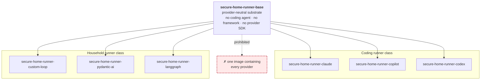
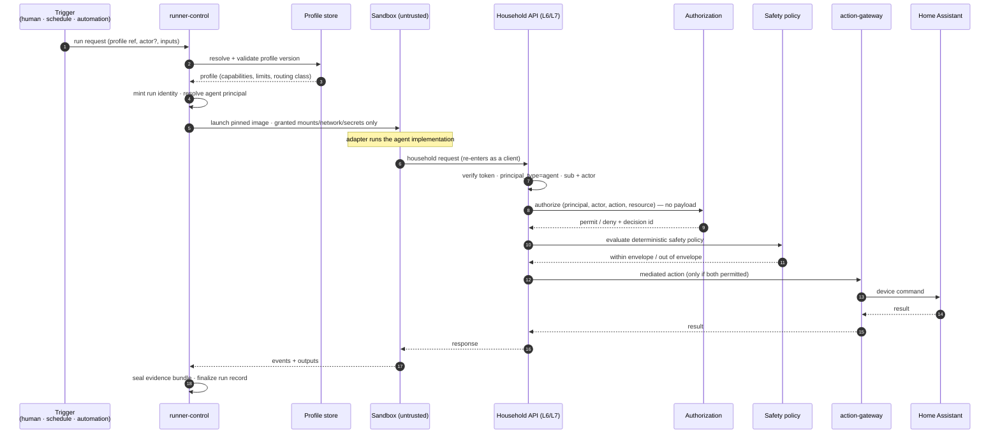

# Runner Model

How agents execute. Governed by
[ADR-0003](../decisions/ADR-0003-use-framework-neutral-runner-profiles.md),
[ADR-0006](../decisions/ADR-0006-separate-agent-implementation-profile-run-and-automation.md),
and [ADR-0011](../decisions/ADR-0011-keep-coding-agent-images-provider-specific.md).

> **Status: not implemented.** No runner image exists, no substrate is built, no
> profile schema is defined. This is the contract those things must satisfy.

## The five concepts, and why they are not the same thing

| Concept | Is | Carries authority? | Lives in |
|---|---|---|---|
| **Agent implementation** | domain code — a climate observer, a security reviewer | **No** | [`agents/implementations/`](../../agents/implementations/) |
| **Runtime adapter** | the shim to a concrete runtime — a coding-agent CLI or a framework | **No** | [`agents/adapters/`](../../agents/adapters/) |
| **Execution profile** | the reviewed, declarative grant of capability | **Yes — this is where authority is granted** | [`profiles/`](../../profiles/) |
| **Run** | one invocation of one profile; an immutable historical fact | inherits the profile's | [`schemas/run/`](../../schemas/run/) |
| **Automation** | a persisted standing arrangement that causes runs | **Yes — separately authorized** | [`services/automation-service/`](../../services/automation-service/) |

Merging any two of these is the failure this model exists to prevent. Most
importantly: **merging implementation and profile** would mean shipping code
could widen production authority without a security review.

## Image lineage

**One runtime per derived image, pinned.** A multi-provider image is prohibited —
[ADR-0011](../decisions/ADR-0011-keep-coding-agent-images-provider-specific.md).

## The base image

Contains substrate concerns only:

- profile loading and validation,
- the run lifecycle: start, cancel, timeout, teardown,
- the event emitter and evidence capture hooks,
- the minimal OS surface required for the above.

Contains **nothing** provider- or framework-specific: no coding agent, no
framework, no provider SDK, no provider credential handling. It does not know
which adapter it will launch.

## The runner substrate

Owned by [`services/runner-control/`](../../services/runner-control/). For every
run, regardless of what runs inside:

| Concern | Contract |
|---|---|
| **Isolation** | One run, one container, one process tree. No shared writable state between runs. |
| **Filesystem** | Only profile-declared mounts, each with an explicit read/write posture. No implicit host access. |
| **Network** | **Default deny.** Egress only to profile-declared destinations, consistent with the declared routing class ([ADR-0007](../decisions/ADR-0007-route-local-remote-and-cloud-execution-explicitly.md)). |
| **Secrets** | Only credentials the profile declares, scoped to the run, never ambient. **No Home Assistant token. No database connection.** |
| **Limits** | CPU, memory, wall clock, and output size. The Pi also carries the household control path; a run must not starve it. |
| **Lifecycle** | Start, cancel, timeout, teardown. Cancellation must be effective, not advisory. Teardown must be complete. |
| **Events** | A uniform event stream, identical in shape across adapters. |
| **Evidence** | A per-run bundle: profile version, image digest, principals, granted capabilities, calls attempted, calls permitted, calls denied, outcome. |

The substrate is provider- and framework-neutral. It does not import an adapter;
it launches one as an isolated process.

## The adapter

Translates a run request into what a concrete runtime expects, and translates
that runtime's output back into the platform event and evidence contract.

- **Coding adapters:** Claude Code, GitHub Copilot CLI, Codex.
- **Framework adapters:** custom deterministic loop, PydanticAI, LangGraph.

Rules:

1. An adapter **cannot widen its own sandbox.** It receives what the profile
   granted, and nothing else.
2. An adapter **must not** reach around the substrate for network, filesystem, or
   credentials.
3. Every adapter emits the **same** event and evidence contract for the same
   logical run. This is asserted by
   [`tests/framework-conformance/`](../../tests/framework-conformance/).
4. If a runtime needs something the profile does not grant, the resolution is a
   reviewed profile change — never an adapter workaround.

## The execution profile

The reviewable artifact that binds everything and grants authority:

| Field group | Contents |
|---|---|
| Identity | profile name, version |
| Runtime | runner image (digest-pinned), adapter |
| Capability | permitted tool surface, filesystem mounts and posture, network policy |
| Execution | routing class (R0–R3), model route, declared fallback behaviour |
| Limits | wall clock, CPU, memory, output size |
| Principal | the agent identity the run authenticates as; whether an `actor` is required |
| Evidence | the evidence contract the run must satisfy |

**A run is launched from a profile, never from ad-hoc parameters.** Anything the
profile does not grant is denied. Schema: [`schemas/execution-profile/`](../../schemas/execution-profile/)
(**not yet defined**).

## Runner classes

| | **Coding runner** | **Household runner** |
|---|---|---|
| Purpose | operates on repositories and documents | observes and acts on the house |
| Tool surface | source control, filesystem, build and test | household read APIs, action requests |
| Network | source control and a model provider, per profile | household API; model access per routing class |
| Household device access | **none, ever** | only via the action-mediation service, after authorization and safety policy |
| Typical routing class | R3 (cloud) | R0/R1, occasionally R2 |
| Runs on | the Pi or a workstation | the Pi |
| Profiles | [`profiles/coding/`](../../profiles/coding/) | [`profiles/household/`](../../profiles/household/) |

A coding runner has **no path to household devices**. This is enforced by the
profile's tool surface and network policy, not by convention.

## Run request path

Step 6 is the load-bearing one: the sandbox **re-enters through the same
governed enforcement point** a browser would use. There is no internal path.

## Evidence and events

Every run produces:

- **an event stream** — start, capability grant, each attempted call and its
  disposition, adapter lifecycle transitions, termination reason;
- **an evidence bundle** — profile version, image digest, principals (`sub`,
  and `actor` or an explicit "autonomous, no actor"), granted capabilities,
  calls attempted/permitted/denied, outputs, outcome, timing.

Properties: **uniform across adapters**, **sufficient to answer "what was this
allowed to do, and what did it do?"** without reading agent code, and durable —
subject to the buffering constraint that the Pi is not authoritative storage.

## Cancellation, timeout, resources

- Every run has a **wall-clock timeout**. There is no unbounded run.
- Cancellation is **effective**: the process tree is terminated and the sandbox
  torn down, not merely signalled.
- Resource limits protect the household control path on the shared Pi.
- **A partially-completed run must never leave a device partially actuated.**
  Device actuation goes through the mediation service, which owns action
  atomicity; the runner cannot actuate directly, so a killed run cannot leave a
  half-open garage door.
- Runs are **not** on the household safety path. A dead substrate must not
  affect local safety automations.

## Open

- The adapter SPI: what the substrate passes in, what an adapter returns, how
  failure is reported.
- Whether `runner-control` runs on the Pi, on the VPS, or both.
- The workload-identity mechanism for run credentials.

All tracked in [`unresolved-decisions.md`](unresolved-decisions.md).
