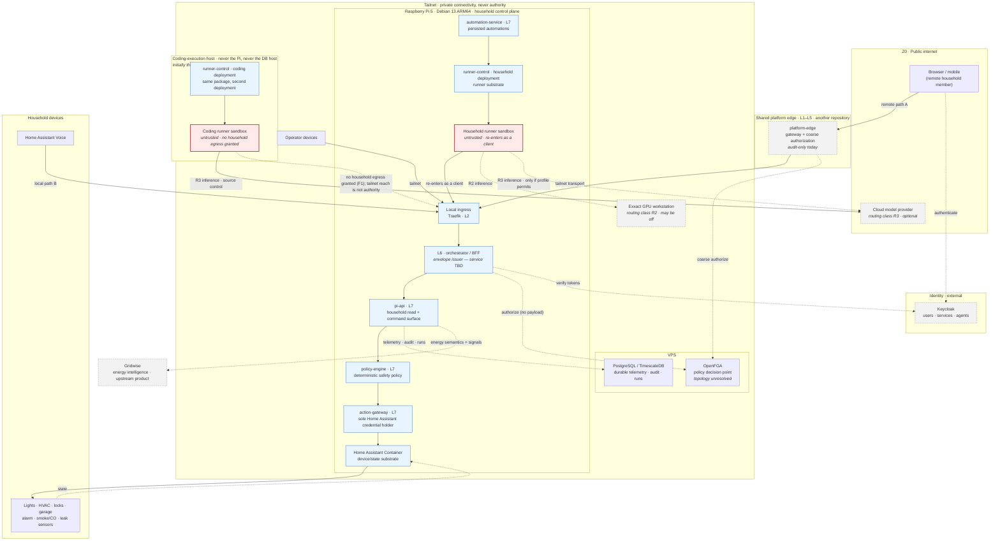

# System Context

Who and what participates, where each part physically lives, and what depends on
what. Governed by
[ADR-0002](../decisions/ADR-0002-adopt-hybrid-home-deployment-profile.md).

> **Status: none of this is deployed.** This describes the target topology. See
> [`INDEX.md`](INDEX.md).

## Diagram

## Participants

### People

| Actor | Reaches the system via | Notes |
|---|---|---|
| **Household member (at home)** | local path — LAN or tailnet → Pi ingress | Must work with the WAN down |
| **Household member (remote)** | shared platform edge → tailnet → Pi | Depends on WAN and shared edge |
| **Household guest** | same as member, narrower authorization scope | Scope is time-bounded |
| **Operator / administrator** | tailnet to the Pi | Tailnet is a network path, not an authorization |

### Interfaces

| Interface | Path | Availability |
|---|---|---|
| **Browser / web application** | Next.js app, Keycloak authentication, BFF over the tailnet | Local path when in-home; remote path otherwise |
| **Home Assistant Voice** | in-home, local path only | Must work offline |

### Compute and control

| Component | Location | Role |
|---|---|---|
| **Raspberry Pi 5** (8 GB, 256 GB NVMe, Debian 13 ARM64, Docker Compose) | in the house | Household control plane. Owns L6 and L7, and the **household** `runner-control` deployment and its execution substrate. Permanently — this is the part that does not move. |
| **Home Assistant Container** | on the Pi (**not yet installed**) | Device and state substrate. **Not** an authorization boundary and **not** a policy engine. |
| **Shared platform edge** (`platform-edge`) | remote | Shared L1–L5 for the **remote path only**. Its L4 is audit-only today. |
| **Keycloak** | external, operated elsewhere | L3 identity for users, services, and agents. Consumed, not run here. |
| **OpenFGA** | topology unresolved | Policy decision point for relationship questions. **Never a request proxy.** |
| **PostgreSQL / TimescaleDB** | VPS | The only authoritative datastore. **No authoritative database is local to the Pi.** |
| **Coding-execution host** | on the tailnet, never the Pi and never the database host | The **coding** `runner-control` deployment and its execution substrate, co-located ([ADR-0020](../decisions/ADR-0020-place-runner-control-by-workload-class.md)). Same package as the household deployment; different placement. Holds no Home Assistant credential, no device authority, and no database connection. **May be unavailable** — coding runs are not household-critical. |
| **Exxact GPU workstation** | on the tailnet | Optional heavy private inference (R2). **May be powered off.** Initially it is *also* the coding-execution host; the two roles are separate and may later be separate machines. |
| **Cloud model provider** | public internet | Optional (R3). Only when a profile explicitly permits it. |
| **Tailscale tailnet** | spans Pi, VPS, workstation, operators | Private connectivity. **Never identity, never authorization.** |
| **Gridwise** | existing product | Upstream energy intelligence. This repository consumes it and does not reimplement it. |

### Devices

Lights, HVAC and thermostats, door locks, garage doors, alarm system,
smoke/CO detectors, leak sensors, cameras. Reachable **only** through Home
Assistant, and Home Assistant is reachable **only** through the action-mediation
service ([ADR-0004](../decisions/ADR-0004-treat-agents-as-clients.md)).

## Dependency posture

What household operation **must not** depend on:

- the WAN,
- the shared platform edge,
- the Exxact workstation,
- the coding-execution host,
- any cloud model provider,
- durable writes to the VPS completing.

What it **does** depend on:

- the Pi being up,
- Home Assistant being up,
- local deterministic policy evaluation,
- a local authorization answer for anything sensitive — **the unresolved
  problem**, see
  [`unresolved-decisions.md`](unresolved-decisions.md) and
  [ADR-0009](../decisions/ADR-0009-define-degraded-mode-and-offline-authorization.md).

## The Gridwise relationship

Gridwise already provides energy intelligence: tariff modelling, consumption
analysis, and cost signals. This repository is **not** an energy product and
does not reimplement any of it.

- Gridwise is an **upstream source**, consumed through its own interface.
- Gridwise **semantics** — what a tariff structure means, what a metric
  represents — are knowledge-bundle content
  ([ADR-0010](../decisions/ADR-0010-use-okf-for-portable-knowledge-only.md),
  [`knowledge/household/energy-semantics/`](../../knowledge/household/energy-semantics/)).
- Gridwise **signals** may inform a household decision (for example, pre-cooling
  ahead of a peak window). They never bypass authorization or safety policy: a
  price signal is an input, not an authority.

## What this repository owns

**Owns:** L6 and L7 for both paths, the runner substrate — one package,
**two deployments** placed by workload class — execution profiles,
household authorization modelling, deterministic safety policy, action
mediation, automations, audit and verification, knowledge bundles, deployment
assets.

**Consumes:** Keycloak (identity), the shared platform edge (remote L1–L5),
OpenFGA (decision point), TimescaleDB (durable data), Gridwise (energy
intelligence), Home Assistant (device substrate), Tailscale (connectivity).

**Does not own:** anything in `platform-edge` or
`security-first-platform-architecture`. Those are pinned references; changes go
there, not here.
