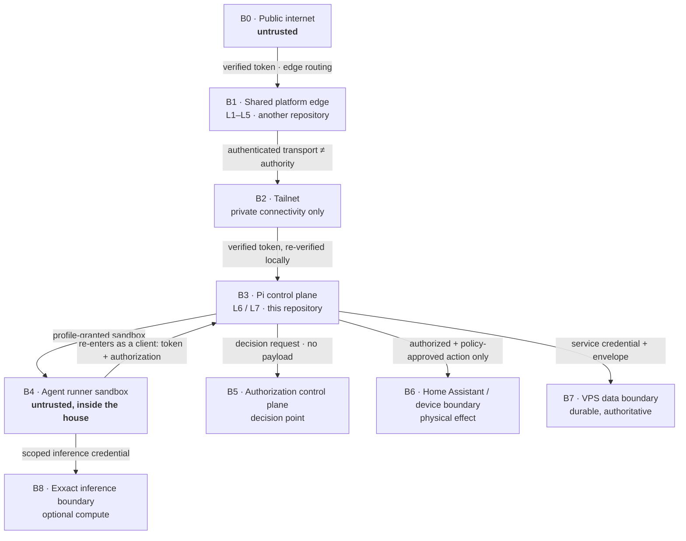

# Trust Boundaries

Every boundary in this system, and the evidence required to cross it.

Inherits the upstream trust-zone model (Z0 public → Z4 internal trusted) and its
non-negotiable rule: **a zone crossing requires verifiable evidence, never a
network fact.** Governed by
[ADR-0001](../decisions/ADR-0001-adopt-security-first-architecture.md),
[ADR-0002](../decisions/ADR-0002-adopt-hybrid-home-deployment-profile.md), and
[ADR-0004](../decisions/ADR-0004-treat-agents-as-clients.md).

> **Status: not implemented.** These are the boundaries the design requires, not
> boundaries that currently exist.

## The rule that everything else follows from

> **A Docker network is not authority. A tailnet is not authority. Co-location on
> the Pi is not authority.**

This is stated first because it is the rule most likely to be violated here. On
this platform, the agent runner sandbox, the control services, and Home
Assistant will all run as containers on **one Raspberry Pi**, on shared Docker
networks. Everything will be able to reach everything at the network level.

Reachability is not permission. Every hop between these containers still
requires the evidence listed below. A service that accepts a request because it
"came from inside the compose network" is a defect, not an optimization —
including a service that trusts a header simply because the request arrived on
an internal interface.

The same applies to the tailnet. Tailscale gives authenticated *connectivity*
between the Pi, the VPS, the workstation, and operators. It never answers "who
is this caller?" for a platform request, and it never answers "may they?".

## Boundaries

| # | Boundary | Inside | Crossing requires |
|---|---|---|---|
| **B0** | Public internet | nothing trusted | — |
| **B1** | Shared platform edge | shared L1–L5 | Network admission and edge routing; a token verified at L3. **Its L4 is audit-only today — a `deny` there does not stop the request.** |
| **B2** | Tailnet | Pi, VPS, workstation, operators | Tailscale device authentication. **Grants reachability only.** Never an identity or an authorization for a platform request. |
| **B3** | Pi control plane | L6/L7 services on the Pi | A token this control plane verifies **itself**. It does not trust the shared edge's assertion headers without validating origin provenance. |
| **B4** | Agent runner sandbox | one run's process tree | Only what the execution profile grants. **Treated as untrusted** even though it runs on the Pi. Re-entry is a full client crossing of B3. |
| **B5** | Authorization control plane | policy decision point + model store | A decision request containing principal, action, resource, and context. **No request body, no household payload, no device command ever crosses this boundary.** |
| **B6** | Home Assistant / device boundary | Home Assistant and every physical device | A command from the action-mediation service **only**, after authorization *and* deterministic safety policy have both permitted it. The sole holder of Home Assistant credentials. |
| **B7** | VPS data boundary | TimescaleDB/Postgres — authoritative | A service credential over the tailnet, carrying the internal identity envelope. **No agent runner has a database connection.** |
| **B8** | Exxact inference boundary | GPU workstation | A scoped credential from a profile that declares routing class R2. Optional: unavailability must not affect household operation. |

## The runner sandbox is the important one

B4 is the boundary most likely to be argued away, so it is stated explicitly.

The agent runner sandbox is **inside the house, on the control-plane host, and
untrusted**. Its contents are, by design, partly determined by a model whose
behaviour cannot be fully predicted and which may be influenced by content it
reads.

Therefore:

1. **Default deny outbound.** No network egress except what the profile grants.
2. **No ambient credentials.** No Home Assistant token, no database connection,
   no cloud key unless the profile grants it for the declared routing class.
3. **Re-entry is a full client crossing.** When a run calls the household API it
   authenticates, is authorized, and passes safety policy exactly like a browser
   would. There is no internal shortcut.
4. **Filesystem is explicit.** Only profile-declared mounts, with a declared
   read/write posture.
5. **Bounded resources.** CPU, memory, wall clock, and output size are limited
   so a run cannot starve the household control path sharing the same Pi.
6. **Everything is evidenced.** What the run touched is recorded.

See [`runner-model.md`](runner-model.md) and
[ADR-0003](../decisions/ADR-0003-use-framework-neutral-runner-profiles.md).

## Anti-patterns rejected here

| Anti-pattern | Why it is rejected |
|---|---|
| "It's on the compose network, so it's trusted." | Every container on the Pi shares networks. This grants nothing. |
| "It came over the tailnet, so the caller is known." | Tailnet authenticates a *device*, not a platform principal. |
| "The agent runs on our hardware, so it's internal." | The sandbox is untrusted by design ([ADR-0004](../decisions/ADR-0004-treat-agents-as-clients.md)). |
| "The edge already authorized it." | The shared edge answers a coarse question, and today does not enforce at all. |
| "Home Assistant can decide who may unlock the door." | Home Assistant is a device substrate, not a policy decision point ([ADR-0008](../decisions/ADR-0008-use-openfga-for-relationships-and-deterministic-policy-for-safety.md)). |
| "Give the runner a read-only DB connection; it's only reading." | A read-only connection still bypasses service-level authorization, tenant scoping, and audit. |
| "Trust `x-platform-edge-*` because it arrived on the internal interface." | Header trust requires validated origin provenance. Upstream states this explicitly. |
| "Local requests can skip authorization." | Network position under a friendlier name. |

## Evidence at each crossing

| Crossing | Evidence produced |
|---|---|
| B0 → B1 | Edge access record; verified token; coarse decision (**audit-only today**) |
| B1/B2 → B3 | Locally verified token; validated origin provenance |
| B3 → B5 | Authorization decision with a decision identifier that joins to the request |
| B3 → B6 | Action record: run, profile version, principal `sub` and `actor`, authorization decision, safety-policy verdict, device command |
| B3 → B4 | Run record: profile version, image digest, granted capabilities |
| B4 → B3 | A normal client request record — indistinguishable in form from a browser request, and marked `principal_type=agent` |
| B3 → B7 | Envelope-carrying service call; durable write record |

Every **rejection** is evidenced too: which boundary rejected, why, and with
what correlation identifier. A silent denial is a defect.

## Open

- Whether the household authorization store shares a runtime with the shared
  edge store — see [`unresolved-decisions.md`](unresolved-decisions.md).
- The workload-identity mechanism that gives a runner a credential at B4→B3.
- How origin provenance at B3 is proven for requests arriving via B1.
- The Home Assistant credential strategy at B6.
