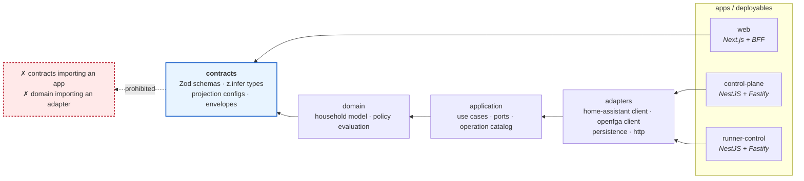
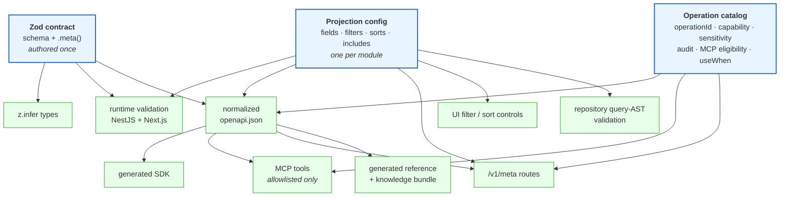

# ADR-0012: Adopt TypeScript, NestJS, and pnpm as the primary implementation stack

- **Status:** Proposed
- **Date:** 2026-08-06
- **Deciders:** repository owner (pending human acceptance)
- **Supersedes:** none
- **Refines:** [ADR-0003](ADR-0003-use-framework-neutral-runner-profiles.md), [ADR-0006](ADR-0006-separate-agent-implementation-profile-run-and-automation.md) — decides *how* their contracts are authored, without changing what they require
- **Related:** [ADR-0002](ADR-0002-adopt-hybrid-home-deployment-profile.md), [ADR-0004](ADR-0004-treat-agents-as-clients.md), [ADR-0005](ADR-0005-separate-capability-authorization-and-safety.md), [ADR-0008](ADR-0008-use-openfga-for-relationships-and-deterministic-policy-for-safety.md), [ADR-0009](ADR-0009-define-degraded-mode-and-offline-authorization.md), [`docs/architecture/api-contract-model.md`](../architecture/api-contract-model.md), issue #5, roadmap #4

## Context

ADR-0001 through ADR-0011 are accepted. They decide the *logical* architecture —
layers, boundaries, controls, and the separation of implementation, profile, run,
and automation — and they are deliberately implementation-neutral. None of them
says what language the control plane is written in, and none of them can be built
without answering that.

The scaffold currently has a `uv` Python workspace with five service placeholders
and three package placeholders, plus a `pnpm` workspace with two TypeScript
package placeholders. That split was a scaffolding convenience, not a decision.
Nothing is implemented in either.

Three forces make the choice urgent now:

1. **The first slice is an API slice.** Roadmap #4's acceptance test — *"is my
   garage closed?"* — is a governed read that must traverse identity,
   authorization, freshness normalization, and audit. Everything about it is
   contract shape.
2. **Agents are first-class callers.** [ADR-0004](ADR-0004-treat-agents-as-clients.md)
   makes an agent re-enter through the same enforcement point a browser uses. A
   contract that a browser can consume but a model cannot reason about would
   force a second, parallel description of the API — which would drift.
3. **The contract surface is large and must not be written twice.** Request DTOs,
   response DTOs, query parameters, validation, OpenAPI, SDKs, MCP tool schemas,
   metadata routes, and generated reference are all *the same information*.
   Every hand-maintained duplicate of it is a place where the documentation and
   the enforced behaviour diverge silently.

The dominant failure mode in NestJS codebases is exactly that duplication: a
`class-validator` DTO for validation, `@ApiProperty` decorators for Swagger, a
separate TypeScript interface for the client, and a hand-written schema for
anything machine-facing — four descriptions of one contract, kept in sync by
discipline.

## Decision

### 1. TypeScript is the primary implementation language

The control plane, the runner substrate, the web application, and all shared
packages are TypeScript.

### 2. NestJS on Fastify is the backend framework

NestJS provides the module boundaries, dependency injection, and lifecycle the
L6/L7 split needs; Fastify is the HTTP adapter. The Pi is resource-constrained
and also carries the household control path
([ADR-0002](ADR-0002-adopt-hybrid-home-deployment-profile.md)), so the lighter
adapter is the correct default.

### 3. pnpm workspaces are the monorepo and package boundary

**Not Nest CLI monorepo mode.** Nest's monorepo mode organizes *Nest
applications and libraries*; it does not give the web application, the shared
contract packages, or a future generated SDK a first-class place, and it couples
package layout to one framework. This repository already needs packages that no
Nest application imports — the Next.js app, the contracts package consumed by
generated clients, the MCP surface. pnpm workspaces are framework-neutral, which
also keeps [ADR-0003](ADR-0003-use-framework-neutral-runner-profiles.md)'s
neutrality rule honest at the package layer.

### 4. Next.js is the web framework

Unchanged from the scaffold's stated intent
([`apps/web/README.md`](../../apps/web/README.md)).

### 5. Initial deployment shape

| Deployable | Contains | Why separate |
|---|---|---|
| **`control-plane`** | household API, authorization enforcement, deterministic safety policy, action mediation, automation — as **Nest modules in one process** | They are on one request path, share one enforcement point, and must fail closed together. Splitting them at the start would buy distribution cost and no isolation benefit. |
| **`runner-control`** | the runner substrate | It launches untrusted sandboxes ([`trust-boundaries.md`](../architecture/trust-boundaries.md) B4). Separate process, separate lifetime, separate resource envelope, so a runaway run cannot starve the household control path. |
| **web application** | Next.js + its BFF | Different runtime, different scaling, different exposure. |

Module boundaries inside `control-plane` are drawn so that extraction is a
deployment change, not a rewrite: modules communicate through application
services and typed ports, never by reaching into each other's repositories.

### 6. Python is restricted to isolated specialist inference workers

Python is permitted **only** where a mature ML, vision, or audio dependency
requires it and no adequate TypeScript equivalent exists.

**A Python worker may never own:**

- authorization decisions,
- deterministic safety policy,
- Home Assistant credentials or any device actuation,
- authoritative persistence,
- envelope minting or verification as an enforcement point.

A worker consumes inputs and returns inferences. It is a **compute dependency**,
not a control-plane component, and it sits behind the same governed enforcement
point as any other caller. This is the agent-as-client rule
([ADR-0004](ADR-0004-treat-agents-as-clients.md)) applied to an internal
component, and it is not negotiable for convenience.

### 7. Zod is the single source of truth for API and domain-facing contracts

One Zod definition per contract produces, without a second authored artifact:

- request and response DTOs, and path / query / header parameter DTOs;
- shared TypeScript types via `z.infer`;
- runtime validation at both NestJS and Next.js boundaries;
- `.meta()` descriptions, examples, semantics, and AI-agent guidance;
- OpenAPI component schemas and operation examples;
- generated SDK contracts;
- MCP tool input and output schemas;
- generated API reference and knowledge material.

**Zod is not the source of truth for database tables.** See decision 13.

### 8. Handwritten DTO classes for validation, typing, or reflection are prohibited

Do not duplicate a Zod definition with `class-validator`, `class-transformer`,
`@ApiProperty`, or a hand-maintained Swagger DTO class. If a class exists only to
restate a Zod schema, it is the defect.

A controller handler contains exactly four things: the HTTP route, one governed
operation contract, parsed Zod inputs, and an application-service call.

The decorator and pipe surface (`ApiZodParams`, `ApiZodQuery`, `ApiZodBody`,
`ApiZodResponse`, and the composite `ApiContract`) is specified in
[`api-contract-model.md`](../architecture/api-contract-model.md). Whether it is
implemented first-party or over an existing adapter is a bounded implementation
choice; **the contract it must satisfy is fixed here.**

**Path parameters are declared in Zod and validated against the route
template.** An optional path parameter fails contract validation, because an
OpenAPI path parameter is always required — a mismatch that is otherwise found in
production.

### 9. OpenAPI is a deterministic, normalized, CI-verified artifact

A fixed pipeline produces one document, and that document is the **only** one any
consumer reads:

```ts
let document = SwaggerModule.createDocument(app, swaggerConfig)

document = cleanupOpenApiDoc(document)
document = normalizeIncludeOpenApi(document)
document = normalizeFilterSortOpenApi(document)
document = promoteSchemaExamplesToResponses(document)
document = removeInvalidRequestBodies(document)
document = attachOperationCatalogMetadata(document)
document = validateOpenApiDocument(document)
```

Consumers: Swagger UI, the committed `openapi.json`, compatibility checks, SDK
generation, MCP generation, the metadata routes, generated Markdown reference,
and knowledge bundles. **No consumer reads the raw Nest output.**

CI fails on: a duplicate or missing `operationId`; a request body on GET or HEAD;
an example that does not validate against its own Zod schema; non-deterministic
normalization output; and OpenAPI drift or an unapproved breaking change.

**Only JSON-Schema-representable Zod features may cross the published boundary.**
Zod's converter throws by default on `bigint`, `int64`, `symbol`, `undefined`,
`void`, `date`, `map`, `set`, `nan`, `custom`, `function`, and `transform`. That
default is **kept** (`unrepresentable: "throw"`), so an unpublishable contract is
a build failure rather than a silently empty schema. Targets JSON Schema
2020-12, matching OpenAPI 3.1. Where a transform makes input and output differ,
the request and response schemas are generated separately.

### 10. A governed operation catalog is the join point

One entry per operation, joining `operationId`, route and method, input/output
schemas, capability, sensitivity, read-only versus side-effect classification,
confirmation posture, idempotency behaviour, audit event names, degraded-mode
semantics, MCP eligibility, `useWhen`, and `doNotUseWhen`.

**MCP tools are generated only from an allowlisted subset of this catalog.**
Exposing every route as a tool automatically is prohibited: MCP eligibility is a
deliberate, reviewable property of an operation, not a side effect of it existing.

### 11. Metadata routes are first-class and generated

`GET /v1/meta`, `GET /v1/meta/resources/:resource`, and
`GET /v1/meta/operations/:operationId` are generated from the Zod contracts, the
operation catalog, and the module projection configurations — never
hand-maintained beside them.

Metadata is **authorization-aware** and must never expose hidden administrative
operations, Home Assistant entity IDs, database columns, OpenFGA tuples, SQL
structure, or credentials. **Metadata describes; it never grants.** An agent uses
it to build a validated query AST, and discovering an operation is not permission
to invoke it.

### 12. One projection configuration per API module

Each module owns exactly one configuration declaring fields, includes, filters
and their permitted operators, sorts, default projection, default sort, stable
cursor tie-breaker, pagination limits, include depth, include item limits, and
include cost.

**That configuration is the module's maximum query surface.** It generates the
Zod query DTO, runtime validation, OpenAPI query metadata, `/v1/meta` resource
metadata, MCP guidance, SDK helpers, UI filter controls, and repository query-AST
validation.

**Authorization may narrow it for a caller; nothing may widen it.** Models and
MCP clients produce only a validated query AST — never SQL, ORM predicates, or
arbitrary field expressions.

### 13. Persistence stays separately modelled — toolkit deferred

The boundary is decided and holds regardless of toolkit:

```
Zod                 DTOs, shared API/domain types, validation, metadata, OpenAPI, MCP
persistence toolkit tables, columns, indexes, constraints, migrations, RLS policies
PostgreSQL          authoritative persisted data and enforcement
```

**A database schema must never automatically become a public DTO.** The mapping
between them is explicit and reviewable, because that mapping is where
over-exposure happens.

**The toolkit itself is not selected here.** There is no data model, no query
workload, and no RLS design in this repository yet, so choosing between TypeORM,
Drizzle, Kysely, or Prisma now would be a preference dressed as a decision — the
failure mode this repository has consistently refused. It is recorded as
[U11](../architecture/unresolved-decisions.md#u11) with explicit selection
criteria, and it is decidable once the first real household data model exists
(issues #28–#31).

Row-level security, when it arrives, is **defence in depth beneath** application
authorization, never a replacement for it: the policy decision point still
decides ([ADR-0008](ADR-0008-use-openfga-for-relationships-and-deterministic-policy-for-safety.md)),
and RLS ensures a bug in a repository cannot return another household's rows.

### 14. Cross-cutting platform conventions

Decided here, specified in [`api-contract-model.md`](../architecture/api-contract-model.md):
four response envelopes with cursor pagination by default and no exact counts
unless explicitly requested; RFC 9457 problem details; Winston behind a shared
logging package; `AsyncLocalStorage` request context; stable machine-readable
event names with correlation and causation identifiers; audit as a separate
durable contract, not logging; optimistic concurrency via ETag or version field;
idempotency keys for mutations; typed warnings and partial results; UTC
timestamps.

### 15. Package dependency direction is enforced

```
contracts  ←  domain  ←  application  ←  adapters  ←  apps
```

Dependencies point **inward only**. `contracts` imports nothing from the
platform. No package imports an application. Enforced in CI, not by convention.

### 16. `schemas/` becomes generated, not handwritten

[ADR-0003](ADR-0003-use-framework-neutral-runner-profiles.md) and
[ADR-0006](ADR-0006-separate-agent-implementation-profile-run-and-automation.md)
require canonical, versioned contracts for the execution profile, run, action,
and automation objects, and place them in [`schemas/`](../../schemas/). They do
not say how those are authored.

Those contracts are now **authored in Zod** and their JSON Schema published into
`schemas/` as a **generated, CI-verified artifact**. The published contract
remains canonical, versioned, and language-neutral — what changes is that it can
no longer drift from the code that enforces it.

This **refines** ADR-0003 and ADR-0006; it does not supersede them, and neither
is edited. It does change the premise in
[`schemas/README.md`](../../schemas/README.md), which is updated in this change.

### 17. The uv workspace is retained only for Python inference workers

The five Python service placeholders and three Python package placeholders under
[`services/`](../../services/) and [`packages/python/`](../../packages/python/)
are replaced by TypeScript equivalents. The `uv` workspace itself is **kept** —
it is the correct tool for the inference workers decision 6 permits.

**The migration is issue #24 and is not performed here.** It is incremental, with
CI green at every step: TypeScript workspace and shared configuration first, then
applications, then contracts, then removal of superseded Python placeholders.
Removing a Python placeholder before its TypeScript replacement exists would put
the repository in a state where the scaffold validator's directory contracts and
the workspace manifests disagree.

## Questions this ADR was required to answer

| Question | Answer |
|---|---|
| Why pnpm workspaces instead of Nest CLI monorepo mode? | Decision 3 — Nest monorepo mode has no first-class place for the web app, shared contract packages, or a generated SDK, and couples layout to one framework |
| Which logical services begin as Nest modules versus separate deployables? | Decision 5 — one `control-plane` process; `runner-control` and web separate |
| What is the package dependency-direction rule? | Decision 15 — inward only, CI-enforced |
| How are Zod contracts shared among NestJS, Next.js, clients, MCP, and tests? | Decision 7 — one `contracts` package, imported by all; nothing re-declares |
| How do `.meta()` annotations flow into examples, OpenAPI, reference, and agent guidance? | Decision 9 + [`api-contract-model.md`](../architecture/api-contract-model.md) — `.meta()` → global registry → `toJSONSchema` → normalized document → every consumer |
| Which Zod features are allowed in published contracts? | Decision 9 — only JSON-Schema-representable ones; `unrepresentable: "throw"` kept so violations fail the build |
| How are stable `operationId` values governed? | Decisions 9–10 — explicit, in the operation catalog; duplicates and drift fail CI |
| How is the filter/sort/pagination AST defined and constrained per route? | Decision 12 — one projection config per module, the maximum surface |
| Which persistence toolkit is selected, and how are tables kept separate from DTOs? | Decision 13 — boundary decided, toolkit deferred to [U11](../architecture/unresolved-decisions.md#u11) with criteria |
| How is RLS introduced later without replacing application authorization? | Decision 13 — defence in depth beneath the PDP, never instead of it |
| Where are Python workers permitted, and what may they never own? | Decision 6 — inference only; never authorization, safety policy, credentials, actuation, or authoritative persistence |
| What migration happens to the current uv workspace scaffold? | Decision 17 — uv retained for inference workers; placeholders replaced incrementally under issue #24 |

## Package dependency direction



`contracts` is the only package every consumer may import, and it imports nothing
from the platform. That is what makes one Zod definition reusable by a NestJS
controller, a Next.js page, a generated SDK, an MCP tool, and a test without any
of them re-declaring it.

## Contract generation flow



Three authored inputs, everything else generated. Nothing in the generated column
is hand-maintained, and nothing in it may be edited in place.

## Consequences

**Positive.**

- One contract definition, many consumers. The class of bug where validation,
  documentation, and the SDK disagree is removed by construction rather than by
  review.
- The API is machine-consumable by default. MCP tools and agent guidance come
  from the same source as Swagger UI, so an agent and a human cannot be told
  different things.
- Thin controllers make the enforcement path short and reviewable — which matters
  because that path carries authorization, safety policy, and audit.
- One language across control plane, web, and shared packages: one toolchain, one
  test runner, one set of types crossing the BFF boundary.
- Deterministic OpenAPI makes breaking changes detectable in CI instead of at a
  consumer.

**Negative.**

- **Custom decorator and pipe surface to build and maintain.** The thin-controller
  pattern is not free; it is infrastructure, and it must be tested as
  infrastructure.
- **Zod becomes a hard dependency of the contract layer.** A future migration
  away from it would touch every contract. Accepted: the alternative is
  hand-maintained duplication, whose cost is continuous rather than one-time.
- **The generation pipeline is a build-time dependency of correctness.** If
  normalization is non-deterministic, drift detection produces noise and gets
  ignored — so determinism is a tested property, not an aspiration.
- **Projection configs add ceremony to simple list routes.** A three-field
  resource still declares one. The uniformity is what makes metadata and MCP
  generation possible at all.
- Losing Python across most of the platform costs access to some ML tooling.
  Decision 6 keeps the door open exactly where that matters.

**Neutral.**

- NestJS and Zod are **implementation choices for the control plane**. They are
  not platform identities, and they must not appear in a structural position in
  any runner profile, run, event, or evidence contract
  ([ADR-0003](ADR-0003-use-framework-neutral-runner-profiles.md),
  [ADR-0011](ADR-0011-keep-coding-agent-images-provider-specific.md)). A
  household agent adapter written against LangGraph or a plain loop is unaffected
  by anything in this ADR.

## Alternatives considered

- **Nest CLI monorepo mode.** Rejected — decision 3. It is the natural choice if
  the repository were only Nest applications; it is not.
- **`class-validator` + `@ApiProperty`, the conventional NestJS path.** Rejected:
  it is the duplication this ADR exists to prevent. It also produces OpenAPI that
  is adequate for Swagger UI and poor for an agent, because the semantics an
  agent needs (`useWhen`, sensitivity, degraded-mode behaviour) have nowhere to
  live.
- **TypeBox or JSON Schema authored directly.** Considered seriously — both are
  representable-by-construction, removing decision 9's whole failure mode.
  Rejected on ergonomics and ecosystem: Zod's inference and refinement story is
  materially better for domain modelling, and `unrepresentable: "throw"` converts
  the risk into a build failure.
- **tRPC instead of REST + OpenAPI.** Rejected: excellent for a TypeScript-only
  client, but this API must be consumable by MCP, generated SDKs, and future
  non-TypeScript callers. OpenAPI is the interoperable contract.
- **Python (FastAPI) control plane.** Considered — Pydantic offers a comparable
  contract-first story, and it would keep the existing scaffold. Rejected: the
  web application is TypeScript regardless, so this would guarantee two contract
  systems and a translation layer between them.
- **Go.** Rejected: better resource profile on a Pi, but no shared types with the
  web application and a weaker generated-contract ecosystem for this shape of
  problem.
- **Split `control-plane` into separate deployables now.** Rejected: distribution
  cost with no isolation benefit on a single 8 GB host, on components that share
  one enforcement path. Module boundaries keep extraction cheap later.
- **Select a persistence toolkit now.** Rejected — decision 13. No data model
  exists to evaluate against.
- **Expose every route as an MCP tool.** Rejected: MCP eligibility is a security
  property. Automatic exposure would make adding a route a silent expansion of
  what an agent can invoke.

## Security implications

- **The enforcement path gets shorter and more reviewable.** A thin controller
  makes it obvious where authorization, safety policy, and audit are invoked —
  and obvious when one is missing.
- **The projection config is a security boundary, not just an API convenience.**
  It bounds what any caller — including a model — can ask for. Combined with
  "authorization may narrow, never widen", it means a compromised or manipulated
  agent cannot reach fields or relations the module never declared.
- **Query ASTs, never generated SQL.** A model that could emit SQL or ORM
  predicates would be an injection surface with an LLM attached to it. The AST is
  validated against the module config before any repository sees it.
- **Metadata is authorization-filtered and non-granting.** Discovery must not
  become disclosure: entity IDs, columns, tuples, and hidden operations stay out,
  and knowing an operation exists confers nothing.
- **MCP allowlisting keeps agent-invocable surface deliberate.** Adding a route
  must never silently add a tool.
- **Python worker prohibitions are load-bearing.** An inference worker is the
  component most likely to carry a large, fast-moving dependency tree; giving it
  a credential or an actuation path would put the house's physical security
  behind that supply chain.
- **`unrepresentable: "throw"` prevents silent contract holes.** The alternative
  (`"any"`) emits `{}` — a schema that validates everything, published as if it
  constrained something.
- **Examples must validate.** A wrong example in an agent-facing contract is
  worse than none, because a model will follow it.
- **RLS is beneath authorization, never instead of it.** Decision 13.

## Availability implications

- **Fastify over Express** keeps per-request overhead down on a host that also
  carries the household control path.
- **`runner-control` is a separate process** so a runaway or hostile run cannot
  starve the control plane. This is an availability property as much as an
  isolation one ([ADR-0002](ADR-0002-adopt-hybrid-home-deployment-profile.md)).
- **Contract validation is local and offline.** Zod parsing needs no network, so
  the local path keeps working during a WAN, edge, or VPS outage
  ([ADR-0009](ADR-0009-define-degraded-mode-and-offline-authorization.md)).
- **The generation pipeline is build-time only.** No runtime path depends on
  producing OpenAPI; the metadata routes serve a precomputed artifact.
- **Cursor pagination and no default exact counts** bound the cost of a list
  request. An unbounded `COUNT(*)` on the VPS is a foreseeable way for a
  household read to become slow enough to look like an outage.
- **Response envelopes carry degraded and partial state explicitly**, so a
  partial answer is distinguishable from a complete one — required by
  [ADR-0009](ADR-0009-define-degraded-mode-and-offline-authorization.md)'s
  prohibition on silent degradation.
- **No runtime dependency on MCP or SDK generation.** They are consumers of a
  build artifact; their absence cannot affect household operation.

## Validation and follow-up obligations

1. **Do not begin implementation on this ADR until it is accepted.** It is
   `Proposed`; acceptance is a human decision in its own reviewed change.
2. Record the persistence-toolkit selection criteria and decide it in its own ADR
   — [U11](../architecture/unresolved-decisions.md#u11). **Blocking prerequisite
   for any schema, migration, or repository work.**
3. Pin Zod 4 or later (for `.meta()` and native `toJSONSchema`) and pin the
   OpenAPI target to JSON Schema 2020-12 / OpenAPI 3.1.
4. Build the OpenAPI pipeline with **determinism as a tested property**: the same
   input produces a byte-identical document across runs and machines.
5. Add CI gates for: duplicate or missing `operationId`; request bodies on
   GET/HEAD; examples that fail their own schema; OpenAPI drift; unapproved
   breaking changes; package dependency direction.
6. Add a contract-conformance test proving **one** Zod definition drives a NestJS
   controller, the normalized OpenAPI, a Next.js consumer, a metadata resource
   entry, and an MCP tool — the acceptance criterion from issue #5.
7. Add a test that an undeclared field, filter, operator, sort, or include is
   **rejected**, not ignored, and that authorization can narrow but never widen a
   projection config.
8. Add a check that no MCP tool exists without an allowlisted catalog entry.
9. Add a check that no provider or framework name — including `nestjs` and `zod`
   — appears in a structural position in any profile, run, event, or evidence
   contract.
10. Add a check that no Python package imports a Home Assistant client, opens a
    database connection, or implements an authorization or policy decision.
11. Author the knowledge bundle and skills named in
    [`knowledge/platform/README.md`](../../knowledge/platform/README.md), after
    the OKF validator exists ([U7](../architecture/unresolved-decisions.md#u7)).
12. Execute the scaffold migration as issue #24, incrementally, CI green
    throughout.

## References

- Issue #5 (this decision), including the metadata-route and projection-config
  comments; roadmap #4
- [`docs/architecture/api-contract-model.md`](../architecture/api-contract-model.md)
  — the conventions this ADR decides, in detail
- [`docs/architecture/unresolved-decisions.md`](../architecture/unresolved-decisions.md)
  — [U11](../architecture/unresolved-decisions.md#u11)
- Zod 4 JSON Schema conversion: `.meta()`, `z.toJSONSchema`, and the
  unrepresentable-type list that decision 9 relies on
