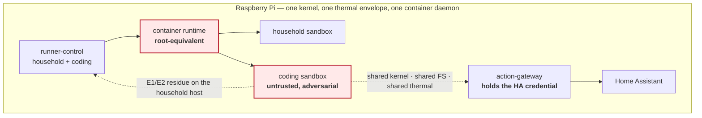
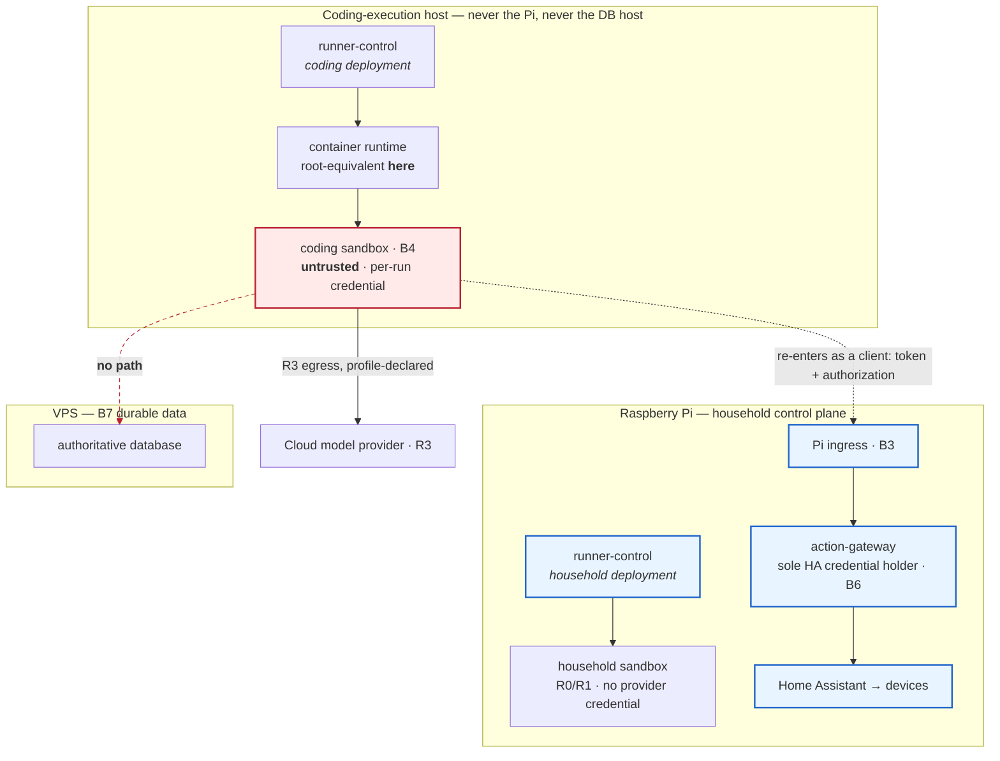

# ADR-0020: Place runner-control by workload class — household control on the Pi, coding execution off it

- **Status:** Accepted
- **Date:** 2026-08-24 — **Accepted 2026-08-26**
- **Deciders:** @mikegtech (repository owner). Acceptance was a separate human act, taken in its own reviewed change; see [the ADR-0020 acceptance record](INDEX.md#adr-0020-acceptance-record).
- **Immutable.** Reverse or amend this decision only by a new ADR that supersedes it — never by editing this file.
- **Decides:** [U4](../architecture/unresolved-decisions.md#u4) — `runner-control` placement (issue #9). **U4 is RESOLVED by this ADR as of 2026-08-26.**
- **Gates:** L9 (#57). The ADR gate on L9 is now **satisfied**: acceptance removes the *decision* blocker, and nothing more. **No launcher, network default-deny, resource ceiling, or isolation mechanism is implemented by this acceptance**, and none may begin without its own authorizing task contract.
- **Depends on:** [ADR-0002](ADR-0002-adopt-hybrid-home-deployment-profile.md) for the two ingress paths and the availability contract; [ADR-0004](ADR-0004-treat-agents-as-clients.md) for the sandbox's trust status; [ADR-0007](ADR-0007-route-local-remote-and-cloud-execution-explicitly.md) for routing classes; [ADR-0009](ADR-0009-define-degraded-mode-and-offline-authorization.md) for degraded posture; [ADR-0011](ADR-0011-keep-coding-agent-images-provider-specific.md) for image lineage; [ADR-0013](ADR-0013-define-the-runner-adapter-spi.md) for the adapter SPI and the L6 evidence it records; [ADR-0017](ADR-0017-classify-asynchronous-effects-at-runner-boundaries.md) for the asynchronous port contract this decision migrates across
- **Changes no accepted ADR.** It selects a deployment topology inside the space ADR-0002 and ADR-0007 already define.
- **Changes no contract.** No schema, no profile field, no port signature. §13 names the contract question this decision *surfaces* and deliberately does not answer.

---

## Context

### The question

[Issue #9](https://github.com/pulse-ops-ai/secure-home-agent-platform/issues/9)
asks where `runner-control` should live — initially and as a target — for
household workloads, coding-agent workloads, and private-heavy workloads.

The question has been open since the scaffold. It is now the last gate in front
of L9 (#57), the one landing that flips this platform from *deciding* to
*enforcing*. L9 must know which host physically owns a cgroup, a network
namespace, a mount, and a credential before it can prove any of them.

### "Placement" is nine questions, not one

The single phrase "where does `runner-control` run" hides nine separable
concerns. This ADR separates them before deciding, because the answer is not the
same for all nine.

| # | Concern | What it is |
|---|---|---|
| 1 | **Orchestration / control responsibility** | deciding a run's lifecycle, acquiring authority, scheduling gates, finalizing — landed as L4 in [`services/runner-control/`](../../services/runner-control/) |
| 2 | **Execution session substrate** | the host kernel that actually holds the process tree, cgroup, namespaces, and mounts |
| 3 | **Coding-agent container placement** | which host runs `secure-home-runner-claude` / `-copilot` |
| 4 | **Household runner placement** | which host runs a household deterministic or small-model run |
| 5 | **Evidence / event persistence** | where the journal and evidence bundle become durable ([U11](../architecture/unresolved-decisions.md#u11), open) |
| 6 | **Credential custody** | which host can read which secret, for how long, and what survives termination |
| 7 | **Image storage / pull** | which host holds and pulls digest-pinned images |
| 8 | **Policy / authorization decision points** | OpenFGA and deterministic safety policy — already placed by [ADR-0005](ADR-0005-separate-capability-authorization-and-safety.md)/[ADR-0008](ADR-0008-use-openfga-for-relationships-and-deterministic-policy-for-safety.md) and untouched here |
| 9 | **Durable remote data** | the authoritative database at boundary B7 |

**They do not have to colocate, and two of them should not.** Concern 2 and
concern 9 sharing a host does **not** merge boundaries B4 and B7 — the canonical
model is explicit that co-location conveys nothing, and it already places B3 and
B4 on the same Pi on purpose
([`trust-boundaries.md`](../architecture/trust-boundaries.md)). A trust boundary
is a logical control, not a machine.

What co-location does is **couple blast radii**. The two boundaries remain
distinct and are still enforced; but a host compromise — or the root-equivalent
container-runtime authority a launcher must hold — reaches everything on that
host at once, whichever boundaries happen to live there. That is the argument
this ADR uses. It is narrower than "the boundaries merge", and it is the one that
survives contact with the canonical model.

### What is landed, and what is not

L4 orchestration is real and deliberately has no launcher. What exists is a port
boundary — `ExecutionPort.runGate()` and `AdapterInvocationPort.invoke()` in
[`services/runner-control/src/ports/`](../../services/runner-control/src/ports/index.ts)
— implemented against deterministic in-memory mechanisms. L5 image lineage is
inert; L7 adapters are unlaunchable. **Nothing in this repository starts, limits,
or kills a process.**

That is what makes this decision tractable: the seam a workload class would move
across already exists, is already asynchronous, and is already governed by
ADR-0017.

### Evidence that constrains the answer

The L6 Copilot spike (#54) and ADR-0013 §Evidence establish five facts. They are
not background; each one eliminates a placement option or forces an obligation.

| # | Finding | Consequence for placement |
|---|---|---|
| **E1** | The tested OS-store credential **remained reusable after provider process termination** | Host login/credential-store state is **not** a per-run containment boundary. Containing a credential to one run requires a boundary destroyed with the run — a container filesystem and user, not a host account. Note the limit of what this establishes: it is about **where a copy can still be read**, not about whether the credential is still *valid* at the provider. |
| **E2** | `COPILOT_HOME` **did not contain all provider state**; cache was written to `~/.cache/copilot` outside it | Redirecting one provider home directory is neither teardown nor isolation. Cache growth is unbounded **on the host filesystem**, which makes storage pressure a placement question. |
| **E3** | Same-user process environment is observable on the host | Per-run credential injection by environment variable is safe only across a process/user/container boundary — never "same host, same user, different env". |
| **E4** | Provider permission controls are incomplete; read-only shell behaviour was demonstrably not a capability boundary | L9 cannot delegate filesystem/network/process enforcement to provider CLI flags. Enforcement must be substrate-owned, therefore host-owned. |
| **E5** | A provider reported `exitCode = 0` and routine shutdown **while the outer process exited 124** under external termination | Lifecycle truth is runner-owned. The host that can observe and kill the process tree is the only one that can state a terminal fact. |

E1–E3 say the blast radius of a coding run is *the host it runs on*, not the
container it was given. E4–E5 say enforcement and termination are properties of
the host kernel. Together they make "which host" a security question rather than
a capacity question — which is why the analysis below does not stop at whether
the Pi is fast enough.

---

## Decision

### 1. Placement is decided per workload class, not per repository

Two runner classes already exist in
[`runner-model.md`](../architecture/runner-model.md) with different tool
surfaces, network posture, routing classes, and device access. This ADR gives
them different placement, because they have different availability requirements
and different adversarial profiles.

| | **Household runner class** | **Coding runner class** |
|---|---|---|
| Availability requirement | **household-critical** — must survive WAN, shared-edge, and VPS loss | **not** household-critical; may be unavailable |
| Adversarial profile | runs reviewed household implementations under R0/R1 | runs a model-driven coding agent that reads untrusted content, installs packages, and executes arbitrary build steps |
| Device reach | via the mediation service only, after authorization and safety policy | **none, ever** |
| Model inference | R0 (no model) / R1 (Pi-local), occasionally R2 | typically R3 (cloud) |

### 2. Initial placement

**Household workloads: the Raspberry Pi. Both the orchestration and the
execution substrate.**

This is not a preference. It is forced:

- R0 means "Pi, no model" and R1 means "Pi, small model"
  ([`local-remote-routing.md`](../architecture/local-remote-routing.md)).
  **R0 and R1 household inference is already Pi-local, and no
  household-critical operation may depend on R2 or R3** — which is what
  ADR-0007 actually guarantees. The household column in §1 permits R2
  occasionally, and R2 is Exxact-hosted rather than Pi-local, so the blanket
  claim that household inference is "already on the Pi" would be false for
  that case. Placing household orchestration elsewhere would put a WAN hop in
  front of the classes whose defining property is that they need no WAN.
- [ADR-0009](ADR-0009-define-degraded-mode-and-offline-authorization.md) and
  [`degraded-mode.md`](../architecture/degraded-mode.md) classify household
  operations that must `CONTINUE` during WAN loss. A remote orchestrator makes
  every one of them WAN-dependent.
- ADR-0002 Path B exists to survive exactly the outages a remote placement would
  introduce.

**Coding workloads: a single dedicated non-household host, which is never the Pi
and never the host holding the authoritative database.**

Initially that host is the **workstation-class tailnet machine** (the machine
described in [`system-context.md`](../architecture/system-context.md) as the
Exxact GPU workstation). Both the coding `runner-control` deployment and the
coding execution substrate live on it, together.

Why that host and not the VPS, initially:

- **The VPS holds boundary B7**, the authoritative durable data. Running the
  coding substrate there would not *merge* B4 and B7 — co-location grants
  nothing, and B7 would still require its service credential and envelope. It
  would **couple their blast radii**: the launcher's root-equivalent
  container-runtime authority, and any host compromise reached through it, would
  land on the machine holding the authoritative household record. A second,
  dedicated VPS instance avoids that coupling — at the cost of new rented
  infrastructure, a new remote credential custody surface, and a new host to
  patch. It is an allowed target variant (§3), not the cheapest first step.
- **Coding-run availability is explicitly not critical.** The workstation "may be
  off" and that is acceptable; a coding run that cannot start is a deferred
  developer task, not a household failure.
- **No repository or credential material reaches a rented host.** The workspace
  and the provider credential stay on a machine the owner already controls.
  This is *not* a claim that all data stays local: coding runs are typically
  R3, and R3 model traffic leaves the tailnet for a third-party provider
  exactly as the execution profile authorizes
  ([ADR-0007](ADR-0007-route-local-remote-and-cloud-execution-explicitly.md)).

Why not the Pi, even though it is simpler: §6 and §7 below.

### 3. Target placement

The target is the same shape with the host chosen operationally rather than
fixed:

- **Household: the Pi. Permanently. This is the part that does not move.**
- **Coding: any host in the `coding-execution` role** — the workstation, a
  dedicated VPS instance, or a future purpose-built machine — subject to four
  invariants that hold for every candidate:

  1. it is **not** the Pi;
  2. it is **not** the host holding the authoritative database (B7);
  3. it holds **no** Home Assistant credential, **no** device authority, and
     **no** database connection — it may still be network-reachable, and B3 is
     what bounds that;
  4. household operation has **no dependency** on its availability.

Moving a coding run from the workstation to a VPS instance is therefore a
deployment change, not an architecture change, provided all four hold.

### 4. What may never move

These are the invariants a future placement change must preserve. They are the
reason §3 is a role rather than a hostname.

- Household orchestration and household execution stay on the Pi.
- No household-critical operation acquires a WAN, shared-edge, VPS, workstation,
  or cloud dependency.
- `runner-control` — either deployment — never obtains a Home Assistant
  credential. That boundary belongs to the action-gateway
  ([`trust-boundaries.md`](../architecture/trust-boundaries.md) B6) and is
  untouched here. [U10](../architecture/unresolved-decisions.md#u10) remains open
  and this ADR does not approach it.
- No coding runner receives a household device credential, on any host.
- Provider credentials never become ambient host credentials (E1, E3).
- Tailnet membership grants reachability and never authority. A coding host on
  the tailnet is *not* thereby an insider.

### 5. Control plane versus execution substrate

For each workload class, orchestration and the execution substrate are
**co-located on one host**. That is a decision, and the alternative was
seriously considered and rejected in §Alternatives (C2).

The reason is the enforcement-capability rule stated in issue #9 and #57: *the
enforcement point must be physically capable of enforcing the thing it claims.*

A `runner-control` on the Pi cannot enforce a cgroup on the workstation. It can
only ask. Asking means something on the workstation accepts the request and
performs the enforcement — which is a control component on the workstation, which
is the two-deployment answer wearing different words, plus a distributed protocol
this ADR is not authorized to invent.

The same rule bites hardest on teardown. ADR-0017 classifies cleanup/teardown as
**best-effort, idempotent at the resource**. L9 (#57) requires *effective*
teardown: process tree dead → container gone → mounts gone → credential
inaccessible → terminal evidence recorded. A remote controller during a network
partition can satisfy "best-effort" and cannot satisfy "effective". Co-location
is what makes the L9 obligation physically satisfiable.

### 6. One package, two deployments

**One `runner-control` package. Two deployments of it, configured differently.**
Not two codebases, not a coordinator/worker protocol, not a new service.

| | Household deployment | Coding deployment |
|---|---|---|
| Host | the Pi | the coding-execution host |
| Runs profiles from | [`profiles/household/`](../../profiles/household/) | [`profiles/coding/`](../../profiles/coding/) |
| Execution substrate | local | local |
| Provider credentials | none | injected per run; local copies destroyed with the run |
| Home Assistant credential | **none** | **none** |
| Database connection | none — evidence leaves via the household path | none |

This is the smallest design consistent with the accepted architecture. It adds
no protocol, no contract field, and no new component. What it adds is a second
deployment of an existing package and an operational rule about which deployment
receives which run request.

### 7. The migration boundary

The seam that makes a workload class movable without touching a domain contract
is **the port boundary already landed at L4**:

```text
ExecutionPort.runGate(request)          -> Promise<GateReport>
AdapterInvocationPort.invoke(request)   -> Promise<AdapterReport>
```

Both are asynchronous by construction and already classified under ADR-0017.
Everything above them — lifecycle, authority acquisition, fencing, finalization,
evidence — is expressed in terms of those promises and of the domain contracts in
[`packages/contracts`](../../packages/contracts/), never in terms of a host.

**This is a named seam, not an escape hatch.** Its limits are explicit:

- It permits *a different local implementation on a different host*. It does not
  by itself permit *a remote implementation invoked across a network*, because a
  remote implementation changes the effect class of teardown from "at the
  resource" to "at the far end of a partition" (§5).
- Moving a workload class means deploying `runner-control` where the substrate
  is. It does not mean pointing an existing deployment at a remote substrate.
- A move that violates any §4 invariant is not a migration; it is a new ADR.

### 8. Credential implications

| Credential | Who may hold it | Where | For how long | Revoked by | What can read it | After termination |
|---|---|---|---|---|---|---|
| **Home Assistant read** | action-gateway only | Pi | service lifetime | rotating at HA | the gateway process | unchanged — never in a runner |
| **Future HA actuation** | action-gateway only ([U10](../architecture/unresolved-decisions.md#u10), open) | Pi | — | — | the gateway process | **this ADR preserves the boundary and decides nothing about the strategy** |
| **Claude / Copilot / Codex provider** | the coding run, per run | coding host, inside the container | **validity: [U2](../architecture/unresolved-decisions.md#u2), open** — not decided here | **at the provider / issuer**. Container teardown does **not** revoke it | that run's process tree only, if containment holds | **no readable copy on the host** — an L9 containment obligation (O4/O5), which is *not* the same as the credential being invalid. E1/E2 prove the default behaviour violates containment |
| **VPS database** | services that write durable data | Pi services | service lifetime | rotating at the VPS | those processes | unchanged — no runner has a DB connection (B7) |
| **Internal service identity** | each service | its own host | per [U2](../architecture/unresolved-decisions.md#u2) (open) | — | — | workload-identity mechanism still undecided |

The load-bearing row is the provider credential, and it needs two properties
kept apart. Conflating them is the mistake this section exists to prevent.

| Property | Who decides it | What it means |
|---|---|---|
| **Issuance, scope, expiry, revocation** | **[U2](../architecture/unresolved-decisions.md#u2), still open** | the credential is minted for one run, scoped to it, and **ceases to be valid** when the run ends |
| **Injection, containment, destruction** | **L9, the substrate** | the credential reaches the run, nothing outside it can read it, and no readable copy — file, cache, keyring entry, environment — survives on the host |

**Container teardown delivers the second property only.** It can prove *"the
terminated run can no longer read this credential from this host."* It cannot
prove *"this credential is invalid everywhere."* A credential that leaked before
teardown, or that the provider still honours, is unaffected by destroying the
container that held it.

[ADR-0013](ADR-0013-define-the-runner-adapter-spi.md) is explicit on this and is
not overridden here: it **does not make credentials ephemeral**, the per-run
environment-token path is **untested**, U2 decides the semantics, and L9 must
prove containment. This ADR decides *where* containment is enforced. It decides
nothing about ephemerality.

E1 showed a host credential store surviving process death; E2 showed provider
state escaping a redirected home. So no host-level login, no shared cache
directory, and no `--home`-style redirection is accepted as a containment
boundary. Placing coding execution on a host that is *not* the Pi means that when
containment is imperfectly met — and E1/E2 say the default is imperfect — the
readable residue lands on a host with no Home Assistant credential, no device
authority, and no database connection.

### 9. Network implications

- **Coding-class profiles do not grant household-service egress.** What a coding
  run reaches is the model provider (R3, profile-declared) and source control.
  The host may nonetheless have tailnet reachability to B3; that reachability
  grants **no platform authority** and remains subject to B3's authentication,
  authorization, and deterministic safety policy. Placement removes authority,
  not network presence — see *What a coding-host compromise actually reaches*.
  The profile half of this is mechanically checked by **F1**; an earlier draft
  of this bullet said the household API was reachable "if a profile grants it",
  which contradicted F1 and is corrected here.
- The Pi's household deployment needs no new reachability.
- **Tailnet membership is not authority.** A coding host that can route to the Pi
  still presents a token, is authorized, and passes safety policy exactly as a
  browser would. This is the anti-pattern
  [`trust-boundaries.md`](../architecture/trust-boundaries.md) names first, and
  putting coding execution on the tailnet is precisely the situation in which it
  would be violated for convenience.
- Per-run network default-deny with profile-declared egress is an L9 obligation
  and is unchanged by placement — it must be enforced on whichever host holds the
  network namespace.

### 10. Resource and blast-radius implications

The Pi analysis is in §Pi contention below. The decision it produces: **a coding
workload never shares a kernel with the household control path.**

### 11. Degraded-mode implications

| Outage | Household runs | Coding runs |
|---|---|---|
| WAN down | unaffected — R0/R1 are Pi-local | R3 inference unavailable; runs fail or use declared fallback |
| Shared edge down | unaffected (Path B) | unaffected if the coding host is reachable on the tailnet |
| VPS down | degraded: no durable writes ([U11](../architecture/unresolved-decisions.md#u11)) | same |
| Coding host down or off | **no effect** | no coding runs — accepted |
| Pi down | household operation is lost — inherent and already accepted | the coding execution host remains available; whether new runs can be **dispatched**, or an in-flight run's **evidence completed**, without the Pi depends on the dispatch path and the eventual [U11](../architecture/unresolved-decisions.md#u11) evidence-transport design (F6) — this ADR decides neither |
| Tailnet unavailable | household local path unaffected (LAN) | coding host unreachable for dispatch |

The point of the split, stated no more strongly than the analysis supports:
**host-local resource, kernel, thermal, and container-runtime failures are
separated by workload class.** Shared network and persistence dependencies
remain and are analysed separately — the VPS row above degrades both classes,
and *What a coding-host compromise actually reaches* keeps enough network reach
to attack household **availability**. This is the same distinction Consequences
draws: placement separates host-local failure, not network presence.

---

## Pi contention and blast radius

The Pi is household infrastructure, not an expendable build runner. The question
issue #9 requires answering explicitly:

> If a coding-agent workload is malicious, buggy, or simply huge, what can it do
> to the household-critical path before L9 controls stop it?

Analysed per resource, assuming the coding workload runs on the Pi:

| Vector | What a coding run does | Household consequence before L9 |
|---|---|---|
| **CPU saturation** | a build, a test suite, a large model-driven edit loop | the control path competes for the same cores; ingress, policy evaluation, and action mediation all slow. Latency on a lock or alarm command is a safety-relevant property, not a comfort one |
| **RAM pressure** | node/npm, language servers, large context assembly | the Pi has 8 GB shared with Home Assistant, ingress, policy, and the gateway. The OOM killer does not know which process is household-critical |
| **PID exhaustion** | a runaway fork loop or a hung process tree | new processes cannot start anywhere on the host, including the control path |
| **Storage pressure** | **E2 directly**: provider cache written outside the redirected home, growing unbounded | a full filesystem stops Home Assistant's recorder, the journal, and every local write |
| **Filesystem churn** | package installs, build outputs | SD/NVMe wear and I/O contention with the household database and logs |
| **Image build/pull** | pulling a digest-pinned coding image | sustained I/O and network during the pull, on the household host |
| **Network saturation** | model streaming, package downloads | competes with Home Assistant device traffic and local ingress |
| **Thermal throttling** | sustained load on a passively- or lightly-cooled SBC | *the entire host* slows, including everything household-critical. This vector has no per-container mitigation |
| **Provider cache growth** | **E2** | as storage pressure, and persists across runs |
| **Credential/cache leakage** | **E1, E3** | reusable credential material and observable environment on the household control host |
| **Container daemon authority** | launching containers requires container-runtime authority | **the most serious.** See below |
| **Upgrades/restarts** | updating a coding image or the coding deployment | restarts and daemon reloads on the household host |
| **Runaway session / hung tree** | **E5**: provider reports success while the outer process is killed | a process the household host must reap, with the provider's own report unreliable about whether it died |

### The container-runtime authority argument

This is the strongest single argument and it is not about capacity.

To launch a container, L9's launcher needs container-runtime authority on its
host. Conventional Docker socket access is **root-equivalent** on that host: a
process that can create a container can mount the host filesystem into it.

If the coding `runner-control` is on the Pi and holds that authority, then a
compromise of `runner-control` — or of anything that can reach its launch path —
is root on the household control plane, beside the action-gateway that holds the
Home Assistant credential.

Thermal throttling and the daemon-authority argument share a property that makes
them decisive: **neither is fixable by a cgroup.** Every other row above can, in
principle, be bounded by L9 limits on a shared host. These two cannot. A CPU
ceiling does not stop a passively-cooled SBC from heating, and a memory limit
does not reduce the authority the launcher itself must hold.

That is why the answer is not "the Pi is fast enough, so co-locate". Capacity is
the weakest reason to separate. Coupling an adversarial-by-design workload to the
household host through a shared kernel, a shared thermal envelope, and a
root-equivalent daemon is the reason.

---

## VPS and remote-host analysis

| Property | Assessment |
|---|---|
| Isolation from household CPU/RAM/thermal | **strong** — a different kernel and a different machine |
| Remote credential custody | provider credentials leave the house. Acceptable for coding credentials, which are already used against a cloud provider; **unacceptable** for anything household |
| WAN dependence | a VPS coding host makes coding runs WAN-dependent. Acceptable **only** because coding is not household-critical |
| Latency | irrelevant for coding runs; would be disqualifying for R0/R1 household runs |
| Availability | better than a workstation that may be off; worse than the Pi for anything local |
| Compromised-host blast radius | source code, provider credentials, and whatever the tailnet lets it reach — availability attacks included. **Authority is bounded by B3**: it re-enters as an ordinary client and gains nothing from network position. Reachability itself is not removed by placement |
| Access back into the tailnet | the real risk. Mitigated by Tailscale ACLs (reachability) **and** by the B3 rule that reachability is never authority. ACLs are defence in depth, never the boundary |
| Temptation to grant household reach | the failure mode to guard. §4 forbids it |
| Durable logging/evidence | attractive — but see below |
| Upgrade independence | **strong** — patching the coding host never restarts household services |

**A VPS placement must not create a mandatory remote dependency for household
functionality, and this decision creates none:** household orchestration and
execution are entirely Pi-local, and the coding host's absence is a no-op for the
house.

**The evidence-colocation temptation is rejected.** It is tempting to put coding
execution on the VPS that already holds the durable database, because evidence
would then be written locally.

State the reason precisely, because the obvious phrasing is wrong. It does **not**
merge B4 with B7: co-location conveys no authority, and a sandbox on that host
would still need B7's service credential and envelope to reach the database — the
canonical model already co-locates B3 and B4 on the Pi for exactly this reason.

The real objection is **blast-radius coupling**. A coding host must hold
root-equivalent container-runtime authority to launch anything. Putting that
authority on the machine that holds the authoritative household record means one
host compromise reaches both the coding substrate and the durable data, in one
step, without crossing B7's logical control at all — it goes underneath it. That
is why §2 requires the coding host not to be the database host, and why the
initial choice is the workstation rather than the existing VPS.

---

## Candidate placements and the decision matrix

### Candidates evaluated

| | Candidate |
|---|---|
| **A** | Pi-local `runner-control` for **all** workloads |
| **B** | Remote/VPS `runner-control` for **all** workloads |
| **C1** | **Split by workload class: two deployments of one package, each co-located with its substrate** — *selected* |
| **C2** | Split: one Pi-local `runner-control` orchestrating a remote execution substrate |
| **C3** | Split: Pi-local coordinator plus remote workers over a new distributed protocol |

### Weighting

Weights are not equal, and the reason is the platform's stated purpose: this is a
**household** system that also happens to run coding agents. Availability and
safety independence of the house dominate; coding convenience does not.

| Weight | Dimensions | Why |
|---|---|---|
| **×3 — decisive** | household availability; household safety independence; credential isolation; blast radius | A failure here is a house that does not work or a compromise that reaches devices. Nothing else can compensate. |
| **×2 — important** | coding workload isolation; cache/state isolation; resource contention; WAN dependency; L9 implementability | Directly determined by placement, and expensive to change later. |
| **×1 — real but recoverable** | operational complexity; upgrade independence; observability/evidence; execution latency; migration cost | Genuine costs, but a wrong answer here is an annoyance, not a hazard. |

Scores are −2 (severely bad) to +2 (strongly good).

| Dimension | W | A: all-Pi | B: all-remote | **C1: split, co-located** | C2: split, remote substrate | C3: coordinator/workers |
|---|---:|---:|---:|---:|---:|---:|
| Household availability | 3 | +2 | **−2** | **+2** | +2 | +2 |
| Household safety independence | 3 | −1 | **−2** | **+2** | +1 | +1 |
| Credential isolation | 3 | −2 | +1 | **+2** | +1 | +1 |
| Blast radius | 3 | **−2** | 0 | **+2** | 0 | −1 |
| Coding workload isolation | 2 | −2 | +2 | **+2** | +2 | +2 |
| Cache/state isolation | 2 | −2 | +1 | **+2** | +1 | +1 |
| Resource contention | 2 | −2 | +2 | **+2** | +2 | +2 |
| WAN dependency | 2 | +2 | −2 | **+1** | +1 | +1 |
| L9 implementability | 2 | +1 | +1 | **+2** | **−2** | −2 |
| Operational complexity | 1 | +2 | +1 | **−1** | −1 | −2 |
| Upgrade independence | 1 | −2 | +1 | **+2** | +1 | +1 |
| Observability / evidence | 1 | +1 | +1 | **0** | 0 | 0 |
| Execution latency | 1 | +2 | −1 | **+1** | +1 | +1 |
| Migration cost | 1 | +2 | −1 | **+1** | 0 | −2 |
| **Weighted total** | | **−7** | **+1** | **+41** | **+22** | **+14** |

The gap is not marginal, and it is not produced by the ×1 rows. C1 wins on every
×3 dimension simultaneously, which is the only combination that satisfies both
"the house keeps working" and "the coding agent is treated as adversarial".

### Why the losing candidates lose

**A — all on the Pi.** Fails on blast radius and credential isolation, both ×3.
E1/E2/E3 mean a coding run's credential and cache residue lands on the household
control host. The container-runtime authority argument means the launcher itself
becomes a root-equivalent capability sitting beside the Home Assistant credential
holder. Thermal coupling has no per-container mitigation. Its genuine advantages —
simplicity, latency, no WAN — are ×1 and ×2 dimensions that cannot repay a ×3
loss. *This is the option the repository was drifting toward by default, and the
one the L6 evidence most directly refutes.*

**B — all remote.** Disqualified by ADR-0002 and ADR-0009 before the matrix is
consulted: it makes household operation depend on the WAN and on a rented host.
ADR-0007's R0 and R1 classes are defined as Pi-local inference; a remote
orchestrator for them is incoherent with an accepted ADR. Scored for
completeness, not because it was ever admissible.

**C2 — Pi-local control, remote substrate.** The near miss, and the one worth
being explicit about. It is attractive because it preserves "one logical
`runner-control`". It fails on L9 implementability (×2, scored −2) for the reason
in §5: a controller cannot enforce a cgroup, a namespace, or a mount on a host it
does not run on, and ADR-0017's best-effort teardown class cannot deliver L9's
*effective* teardown across a partition. To fix that, something on the remote host
must accept and perform enforcement — at which point C2 has become C1 with an
added network protocol, or it has become C3.

**C3 — coordinator plus workers.** Requires inventing a distributed control
protocol: worker registration, health, fencing across hosts, split-brain
resolution, and remote teardown confirmation. Issue #9 and this repository's
governance both forbid inventing a distributed protocol silently, and ADR-0018's
fencing and finalization identity semantics would have to be re-proved across a
network boundary. It may become correct at a larger scale; it is not the smallest
design consistent with the accepted architecture today.

---

## Trust boundaries per candidate

### Candidate A — all workloads on the Pi (rejected)



The dotted edges are not permitted paths — they are **coupling that exists
whether or not anyone intends it**: one kernel, one filesystem, one thermal
envelope, one root-equivalent daemon.

### Candidate C1 — split, each control plane co-located with its substrate (selected)



Root-equivalent container authority now exists **only on a host holding no
household credential, no device authority, and no authoritative data**. The
coding sandbox's only route into the house is B3, as an authenticated,
authorized, safety-policy-checked client — the same crossing a browser makes.
Network reach is not removed by this diagram and is not claimed to be: the
boundary that holds is B3, not the machine boundary.

---

## Routing-class interaction

Routing class and host placement are **different axes**, and conflating them is
the error this section exists to prevent.

[ADR-0007](ADR-0007-route-local-remote-and-cloud-execution-explicitly.md) classes
declare **where model inference happens**, not which host holds the container.

| Question | Answer |
|---|---|
| Can an R3 cloud-model invocation run from a Pi-local container? | **Yes.** R3 constrains the model endpoint and the declared data categories, not the container host. It is permitted by the contract — and this ADR places it elsewhere for security reasons, not contractual ones. |
| Can an R3 invocation run from a coding-host container? | **Yes**, and that is the selected topology. |
| Can an R0/R1 run be placed off the Pi? | **No.** R0 is "Pi, no model" and R1 is "Pi, small model" by definition. Those classes already bind inference to the Pi. |
| Does routing class currently authorize host placement? | **No.** No accepted ADR and no schema field expresses execution-host placement. |
| What authority decides placement today, then? | **Deployment.** Which `runner-control` deployment receives a run request determines where it runs. That is an operational fact, not a declared, reviewable profile property. |
| Would this require a new placement field or contract? | **Possibly — and this ADR does not create one.** See below. |

**The gap this decision surfaces.** Under C1, placement is implied by deployment
rather than declared in the reviewed artifact. That is adequate while there are
exactly two deployments with disjoint profile directories, and it is a weaker
guarantee than this platform applies elsewhere: [ADR-0006](ADR-0006-separate-agent-implementation-profile-run-and-automation.md)
makes the profile the reviewable grant of authority, and placement is now a
security-relevant property that the profile does not state.

**This ADR deliberately does not add a placement field.** Doing so would change
the execution-profile schema to accommodate a preferred topology, which issue #9
forbids and which would be a contract change made for convenience. It is recorded
as follow-up obligation F3 and as a candidate new unresolved decision in
§What remains unresolved.

---

## Security questions answered

| Question | Answer |
|---|---|
| Why can a coding-agent compromise not become **device** authority? | It runs on a different kernel, on a host holding no Home Assistant credential and no database connection. Its only route toward the house is B3, as an ordinary client that must authenticate, be authorized, and pass safety policy — the same crossing a browser makes. Tailnet reachability grants it no authority. **This is a bound on authority, not on consequence** — the honest chain is stated immediately below. |
| Why can a coding workload not starve local household services? | It does not share CPU, RAM, PIDs, filesystem, thermal envelope, or page cache with them. Bounding it is still required — but it is no longer the household's only protection. |
| Why can coding provider credentials not leak into another provider run? | Because containment is per-container and destroyed with the run — **an obligation, not a landed mechanism**, and E1/E2 prove the default violates it. This bounds *reading a copy from this host*. Whether the credential remains **valid** after the run is U2's question, still open; container teardown is not revocation. |
| Why can a provider cache not become a cross-run authority channel? | Same answer, same caveat: teardown must destroy it. E2 is the direct evidence that a redirected home directory does not. |
| Why does WAN loss not disable household-critical behaviour? | Household orchestration, execution, and R0/R1 inference are all Pi-local. Nothing household-critical crosses the WAN. |
| Why can remote coding execution not gain Home Assistant access by being on the tailnet? | Tailnet authenticates a *device*, never a platform principal. B6 is crossed only by the action-gateway, after authorization and safety policy, with a bound approval. |
| Who has container-runtime authority? | The `runner-control` deployment on each host, for that host only. On the Pi that authority is limited to household images; on the coding host it is root-equivalent **on a host that holds no household credential and no device authority** — it retains network reach, and that reach is bounded by B3, never by placement. |
| Is a Docker socket exposed to `runner-control`? | **Not decided here, and deliberately.** L9 chooses the mechanism. This ADR imposes the constraint it must satisfy: a compromise of `runner-control` must not be root-equivalent on the household host. That constraint is much harder to meet on the Pi, which is part of why coding execution is not there. |
| What if `runner-control` itself is compromised? | **Household deployment:** it can launch household images and emit false run facts; it still cannot actuate a device, because it holds no HA credential and every action crosses B6 through the gateway. **Coding deployment:** full control of the coding host and its provider credentials. It is **not** "no household consequence" — see the chain below. |
| Blast radius of a compromised Pi? | Total loss of household control, and the action-gateway's HA credential. This is inherent to a local-first posture, is already accepted in [`local-remote-routing.md`](../architecture/local-remote-routing.md), and this decision **reduces** it by removing coding workloads from that host. |
| Blast radius of a compromised VPS/coding host? | Source code, provider credentials, and tailnet reachability — including the ability to attack household **availability** by flooding what it can route to, and to attempt B3 crossings. It gains no HA credential, no direct device authority, and no database connection. If the coding host were also the database host, one host compromise would additionally reach the authoritative household record — which is why §2 forbids that. |

### What a coding-host compromise actually reaches

The claim "no household consequence" was in an earlier draft of this ADR and is
wrong. This decision removes household **authority** from the coding host; it
does not remove the coding host from the network, and it cannot remove
consequences that do not require authority. The accurate chain:

```text
coding deployment compromised
  -> coding-host compromise: source, provider credentials, container authority
  -> tailnet/network reach REMAINS POSSIBLE
     (reachability is not authority — but it is still reachability,
      and it is enough to attack AVAILABILITY)
  -> any household API crossing STILL requires B3:
     authentication, authorization, and deterministic safety policy
  -> a scoped B3 agent identity may eventually exist on that host
     (U2 is open; when it is decided, a compromised host may hold
      whatever credential U2 grants a run — scoped and expiring,
      never a household or device credential)
  -> NO Home Assistant credential
  -> NO direct device authority
  -> NO database connection
  -> NO privileged bypass of B3
```

What the topology can safely promise is the last four lines. It cannot promise
silence.

**Nothing in this table asserts that an L9 mechanism exists.** Every row that
depends on enforcement is listed below as an obligation.

---

## L9 obligations created by this decision

These are what #57 inherits. Each names the host that must enforce it, because
"the enforcement point must be physically capable of enforcing the thing it
claims".

| # | Obligation | Enforced on |
|---|---|---|
| **O1** | CPU, memory, PID, wall-clock, and output ceilings | **both** hosts, independently, by the local `runner-control` |
| **O2** | Per-run network default-deny with profile-declared egress only; verification gates stay network-none regardless | **both** hosts |
| **O3** | Effective teardown: process tree dead → container gone → mounts gone → credential **inaccessible from this host** → terminal evidence recorded | **both** hosts, locally. Never across a network. |
| **O4** | Per-run credential **containment**: no readable copy of the credential — file, cache, keyring entry, environment — survives on the host after termination, refuting E1. **Scoped deliberately.** L9 proves the terminated run can no longer read it *here*; it does **not** prove the credential is invalid elsewhere. Issuance, scope, expiry, and revocation are [U2](../architecture/unresolved-decisions.md#u2) and remain open | **coding host** (containment) · **U2** (validity) |
| **O5** | Provider cache destroyed with the run, including state written outside any redirected home — explicitly refuting E2 | **coding host** |
| **O6** | Terminal state determined by the substrate's own observation, never by the provider's self-report — explicitly refuting E5 | **both** hosts |
| **O7** | Container-runtime authority held such that a `runner-control` compromise is not root-equivalent on the household host | **Pi**, strictly; coding host, best effort |
| **O8** | Pi-contention evidence: household control-path latency measured **while a household run executes**, since coding runs are no longer on the Pi | **Pi** |
| **O9** | Filesystem and mount enforcement independent of provider flags — refuting E4 | **both** hosts |

**O8 is a scope change #57 should notice.** Its original framing assumed coding
workloads contending on the Pi. Under this decision, Pi-contention evidence is
about *household* runs, and coding-contention evidence belongs to the coding host.

---

## Consequences

**Good.**

- The household and coding failure domains stop intersecting **for resource,
  kernel, thermal, and host-authority failures**. They remain connected by the
  network, deliberately: the coding host keeps tailnet reachability to B3, and
  anything that crosses into the household plane from it crosses B3 like any
  other client — authentication, authorization, deterministic safety policy.
  A coding *run* is not authorized to make that crossing at all: coding-class
  profiles grant no household-service egress (§9, enforced by F1).
- Root-equivalent container authority moves off the household control plane.
- E1/E2 residue — readable credential copies and escaped cache — lands on a host
  holding no Home Assistant credential, no device authority, and no database
  connection, so the L9 containment obligations are defence in depth rather than
  the only barrier.
- The coding host can be patched, restarted, and rebuilt without touching the
  house.
- L9 becomes implementable: every obligation has a host that can physically meet
  it.

**Costs, stated plainly.**

- **Two deployments to operate, configure, and keep at the same version.** Version
  skew between them is a new failure mode; F2 addresses it.
- A second host must exist, be maintained, and be trusted to hold provider
  credentials.
- Coding runs acquire a dependency on that host's availability. Accepted, because
  coding is not household-critical.
- Placement is implied by deployment rather than declared in a reviewed profile —
  a real weakening of the "profile is the authority" property, recorded as F3.
- Evidence from the coding host must reach durable storage over the network, which
  interacts with [U11](../architecture/unresolved-decisions.md#u11).

**Rejected conveniences.** Colocating coding execution with the durable database;
giving the coding host household reach "just for evidence"; treating tailnet
membership as authority; and relying on provider CLI flags for isolation.

---

## Alternatives considered

Detailed in §"Why the losing candidates lose" above: **A** (all on the Pi),
**B** (all remote), **C2** (Pi-local control, remote substrate), and **C3**
(coordinator plus workers). Each was scored, and each rejection names the specific
dimension and evidence that defeated it rather than a preference.

The one an engineer would most reasonably have chosen instead is **C2**, and it is
rejected on a single concrete ground: a controller cannot enforce a cgroup on a
host it does not run on, and best-effort remote teardown does not satisfy L9's
effective-teardown requirement.

---

## Security implications

The decision moves the untrusted, adversarial-by-design workload off the host that
holds the household credential boundary and the local enforcement point. It does
not make that workload safe — L9 does that — but it means an incomplete L9 fails
onto a host whose compromise yields no device authority and no authoritative
record.

**It does not make a coding-host compromise consequence-free.** Network reach
remains, availability attacks remain possible, and once
[U2](../architecture/unresolved-decisions.md#u2) is decided such a host may hold
a scoped, expiring run identity for B3. What placement removes is *authority*,
not *presence*.

It introduces two new exposures. A second host holds provider credentials. And a
tailnet member exists that a future change might be tempted to grant household
authority — §4 forbids that, and F1 requires the prohibition to be mechanically
checkable rather than a documented intention.

It removes no exposure that does not depend on authority. A compromised coding
host still has network reach and can still attack availability; that is bounded
by B3 and by ordinary network controls, never by where the workload was placed.

---

## Availability implications

Household availability strictly improves: a class of workload that could saturate,
overheat, or fill the Pi is removed from it. No household-critical operation gains
any new dependency — the coding host's absence is a no-op for the house.

Coding availability strictly decreases: coding runs now depend on a second host.
This is the trade this ADR deliberately accepts, and it is consistent with U4's own
framing that coding-agent runs are not household-critical.

---

## What remains unresolved

- **[U4](../architecture/unresolved-decisions.md#u4) is no longer among these.**
  It was, while this ADR was `Proposed` — a `Proposed` ADR resolves nothing —
  and acceptance on 2026-08-26 closed it. What that closed is the *decision*;
  L9 (#57) is still unimplemented and still needs its own task contract.
- [U10](../architecture/unresolved-decisions.md#u10) — the Home Assistant
  credential strategy. Untouched; this ADR only preserves the boundary that
  `runner-control` never obtains one.
- [U11](../architecture/unresolved-decisions.md#u11) — durable persistence. This
  decision adds the question of how evidence from a second host reaches it.
- [U2](../architecture/unresolved-decisions.md#u2) — the workload-identity
  mechanism, which decides how a run on either host authenticates at B3.
- [U1](../architecture/unresolved-decisions.md#u1) — bounded offline authority.
  Unaffected.

**Newly surfaced by this decision, and not tracked yet:** whether execution-host
placement should become an explicitly declared, reviewable property rather than an
operational consequence of which deployment receives a request. This ADR does not
create a tracked item for it, because expanding the tracked set is a governance act
for the repository owner. It is recommended as a new entry, and is carried as
obligation **F3** below in the meantime — undecided, and not to be answered by a
schema change made under this ADR.

---

## Evidence reviewed

- Issues [#9](https://github.com/pulse-ops-ai/secure-home-agent-platform/issues/9),
  [#19](https://github.com/pulse-ops-ai/secure-home-agent-platform/issues/19),
  [#56](https://github.com/pulse-ops-ai/secure-home-agent-platform/issues/56),
  [#57](https://github.com/pulse-ops-ai/secure-home-agent-platform/issues/57).
- ADR-0002, ADR-0003, ADR-0004, ADR-0005, ADR-0006, ADR-0007, ADR-0009, ADR-0011,
  ADR-0013, ADR-0017, ADR-0018.
- [`runner-model.md`](../architecture/runner-model.md),
  [`system-context.md`](../architecture/system-context.md),
  [`trust-boundaries.md`](../architecture/trust-boundaries.md),
  [`local-remote-routing.md`](../architecture/local-remote-routing.md),
  [`degraded-mode.md`](../architecture/degraded-mode.md),
  [`unresolved-decisions.md`](../architecture/unresolved-decisions.md).
- **L4** — the landed port boundary in
  [`services/runner-control/src/ports/`](../../services/runner-control/src/ports/index.ts):
  `ExecutionPort`, `AdapterInvocationPort`, and the ADR-0017 effect classes.
- **L5** — [`deploy/images/`](../../deploy/images/) and its digest lock: the
  images this decision places, still inert.
- **L6** — the Copilot capability/credential spike, recorded as findings E1–E5 in
  [ADR-0013](ADR-0013-define-the-runner-adapter-spi.md).
- **L7** — the coding adapters, proven for translation fidelity and deliberately
  unlaunchable.
- [`deploy/AGENTS.md`](../../deploy/AGENTS.md) — the resource-limit and
  no-household-dependency rules this decision must satisfy.

---

## Acceptance criteria

This ADR may be accepted when a reviewer agrees that:

1. Household orchestration and execution are placed on the Pi, and no
   household-critical operation acquires a WAN, VPS, workstation, or cloud
   dependency.
2. Coding execution is placed on a host that is neither the Pi nor the
   authoritative-database host, and holds no Home Assistant credential.
3. The control-plane / execution-substrate co-location rule (§5) is accepted as
   the reason C2 was rejected, or is refuted.
4. The migration boundary (§7) is a real seam with stated limits, not an
   open-ended "we can move it later".
5. The nine L9 obligations (O1–O9) are the right ones, each assigned to a host
   physically capable of enforcing it.
6. The matrix weighting (§Weighting) reflects the platform's actual priorities.
7. No accepted ADR is contradicted and no contract is changed.

---

## Validation and follow-up obligations

| # | Obligation | Owner |
|---|---|---|
| **F1** | A mechanical check that no coding-class profile or deployment asset grants household reach, a Home Assistant credential, or a database connection — the §4 invariants must be checkable, not merely documented | L9 (#57) |
| **F2** | A stated rule for version skew between the two `runner-control` deployments, including which contract versions must match and what happens when they do not | L9 (#57) |
| **F3** | Decide whether execution-host placement becomes a declared, reviewable profile property. **Do not implement a schema change under this ADR.** | new ADR or a tracked unresolved decision |
| **F4** | #57's Pi-contention evidence re-scoped per O8: household runs on the Pi, coding contention on the coding host | L9 (#57) |
| **F5** | The accepting change — and only the accepting change — reconciles all five **in the same accepting change** (the governance property is atomic reviewed acceptance, not a commit count): **(1)** [`INDEX.md`](INDEX.md) fully — move ADR-0020 out of *Under review*, add it to *Implementation decisions* as `Accepted`, add an **`### ADR-0020 acceptance record`** carrying accepted date, decider, review PR, and the U4 resolution, replace the "ADR-0020 is `Proposed`" note, update the *Still blocked* U4/L9 text, the "Which ADRs apply" row that reads "`Proposed` — decides nothing yet", and any open/resolved counts; **(2)** [`unresolved-decisions.md`](../architecture/unresolved-decisions.md) — mark U4 resolved **in place**, in that file's own convention (`> **RESOLVED <date> by <ADR>**` under the `## U4` heading, as U6 and U7 show) **and** in the summary table row; **(3)** [`runner-model.md`](../architecture/runner-model.md) "Runs on" row; **(4)** [`system-context.md`](../architecture/system-context.md) topology; **(5)** [`trust-boundaries.md`](../architecture/trust-boundaries.md), which today binds the sandbox to the Pi — B4 drawn "untrusted, **inside the house**" (line 43), described as untrusted "even though it runs on the Pi" (line 66), and the contention note assuming a run shares "the same Pi" (line 92); **after acceptance B4 has two physical realizations, one per runner class**, and those statements must say so. **After acceptance, not before.** | the accepting change |
| **F6** | Evidence transport from the coding host to durable storage, resolved together with [U11](../architecture/unresolved-decisions.md#u11) | U11's ADR |

---

## References

- [ADR-0002](ADR-0002-adopt-hybrid-home-deployment-profile.md) ·
  [ADR-0004](ADR-0004-treat-agents-as-clients.md) ·
  [ADR-0007](ADR-0007-route-local-remote-and-cloud-execution-explicitly.md) ·
  [ADR-0009](ADR-0009-define-degraded-mode-and-offline-authorization.md) ·
  [ADR-0011](ADR-0011-keep-coding-agent-images-provider-specific.md) ·
  [ADR-0013](ADR-0013-define-the-runner-adapter-spi.md) ·
  [ADR-0017](ADR-0017-classify-asynchronous-effects-at-runner-boundaries.md)
- [`docs/architecture/unresolved-decisions.md#u4`](../architecture/unresolved-decisions.md#u4)
- Issue #9 (this decision) · #19 (program) · #57 (L9, gated on this)
